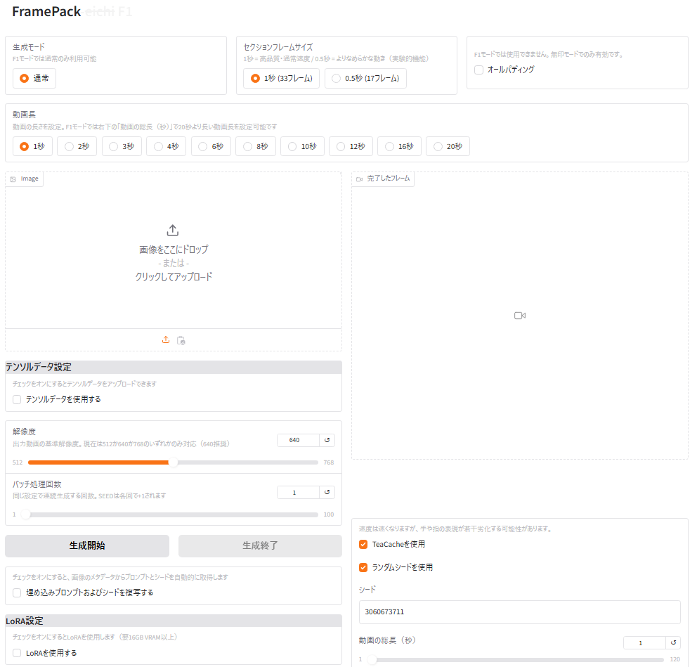
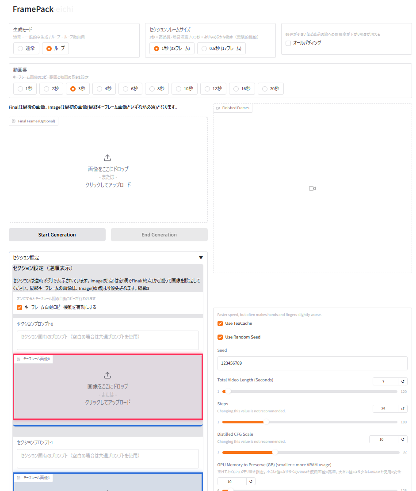
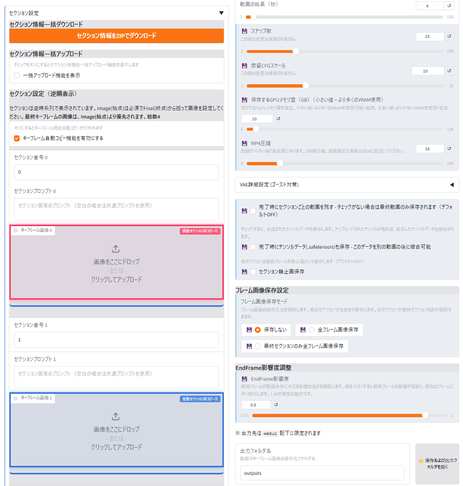
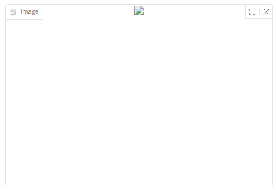

# FramePack-eichi | [日本語](../README.md) | [繁體中文](README_zh.md)

FramePack-eichi is an enhanced version of lllyasviel's [lllyasviel/FramePack](https://github.com/lllyasviel/FramePack), built upon nirvash's fork [nirvash/FramePack](https://github.com/nirvash/FramePack). Based on nirvash's pioneering improvements, it includes numerous detailed features.Additionally, since v1.9, with permission from Kohya Tech, code from [kohya-ss/FramePack-LoRAReady](https://github.com/kohya-ss/FramePack-LoRAReady) has been integrated, significantly improving LoRA functionality and stability.

## 📘 Name Origin

**Endframe Image CHain Interface (EICHI)**
- **E**ndframe: Enhancement and optimization of endframe functionality
- **I**mage: Improvement of keyframe image processing and visual feedback
- **CH**ain: Strengthening connectivity and relationships between multiple keyframes
- **I**nterface: Intuitive user experience and improved UI/UX

The name "eichi" also evokes the Japanese word "叡智" (deep wisdom, intelligence), symbolizing the philosophy of this project to combine AI technology advancement with human creativity.
In other words, it's a ~~local~~ **worldwide** modification specialized in creating videos from intelligently differentiated images. **The eichi has crossed the ocean!**

We're extremely grateful to [https://github.com/hinablue](https://github.com/hinablue) **Hina Chen** for multilingual support cooperation.

## 🌟 New Feature: F1 Model Addition (v1.9.1)

**FramePack-eichi v1.9.1** adds a new forward-generation model "FramePack-~~eichi~~ F1" alongside the traditional reverse-generation model "FramePack-eichi" (standard version).



### 🆚 Differences Between F1 Model and Standard Model

| Feature | F1 Model | Standard Model |
|---------|----------|----------------|
| Generation Direction | Forward generation (first to last) | Reverse generation (last to first) |
| Movement Characteristics | More movement, intuitive results | More precise control possible |
| UI Elements | Simplified | Detailed settings available |
| Ease of Use | Beginner-friendly, intuitive | Advanced, complex control possible |
| Keyframes | Image only | Image, Final, Section images |
| Launch Method | run_endframe_ichi_f1.bat | run_endframe_ichi.bat |

### 💡 Which One Should You Choose?

- **First-time users or those wanting simplicity** → **F1 Model** recommended
  - More natural movement results easily obtained
  - Fewer settings for intuitive operation
  - Available through dedicated launch script (`run_endframe_ichi_f1.bat`)

- **Users wanting advanced control or experienced users** → **Standard Model** recommended
  - Detailed control using multiple keyframe images
  - Advanced features like section-specific prompts
  - Available through traditional launch script (`run_endframe_ichi.bat`)

**Note:** When launching the F1 model for the first time, approximately 24GB of additional model downloads will occur in addition to the standard model. The standard model will also be retained, allowing you to switch between them.

## 🌟 Main Features

- **High-Quality Video Generation**: Generate natural motion videos from a single image (existing feature)
- **F1 Model Support**: New model for forward generation, enabling more intuitive video creation (added in v1.9.1)
- **Flexible Video Length Settings**: Support for 1-20 second section modes (unique feature)
- **Section Frame Size Settings**: Toggle between 0.5-second and 1-second modes (added in v1.5)
- **All-Padding Function**: Use the same padding value for all sections (added in v1.4)
- **Multi-Section Support**: Specify keyframe images across multiple sections for complex animations (feature added by nirvash)
- **Section-Specific Prompts**: Ability to specify individual prompts for each section (added in v1.2)
- **Efficient Keyframe Image Copy with Red/Blue Frames**: Cover all sections with just two keyframes (added in v1.7)
- **Tensor Data Saving and Combining**: Save and combine latent representations of videos (added in v1.8)
- **Prompt Management**: Easy saving, editing, and reuse of prompts (added in v1.3)
- **PNG Metadata Embedding**: Automatically record prompts, seed values, and section information in generated images (added in v1.9.1)
- **Hunyuan/FramePack LoRA Support**: Add custom expressions through model customization (significantly improved in v1.9/v1.9.1)
- **FP8 Optimization**: Reduce VRAM usage and optimize processing speed for LoRA application (added in v1.9.1)
- **MP4 Compression Settings**: Adjust the balance between video file size and quality (merged from original in v1.6.2)
- **Output Folder Management**: Specify output folders and OS-independent folder opening (added in v1.2)
- **Multilingual Support (i18n)**: UI in Japanese, English, and Traditional Chinese (added in v1.8.1)
- **Docker Support**: Easily run FramePack-eichi in a containerized environment (added in v1.9.1)



**Section Settings Screen**


## 📚 Related Documents

- **[Setup Guide](README_setup_en.md)** - Detailed installation instructions
- **[User Guide](README_userguide_en.md)** - Detailed usage instructions
- **[Configuration Information](README_column_en.md#-%EF%B8%8F-configuration-information)** - Detailed configuration options
- **[Changelog](README_changelog.md)** - Complete update history

## 📝 Latest Update Information (v1.9.1)

### Major Changes

#### 1. F1 Model Addition
- **New Forward Generation Model**: Introduced the "FramePack_F1_I2V_HY_20250503" model supporting normal generation direction (first to last)
- **Simplified Interface**: Removed Section (keyframe images) and Final (endframe) functions for F1 model
- **Dedicated Launch Scripts**: Added `run_endframe_ichi_f1.bat` and multilingual version scripts
- **Image Influence Adjustment**: Added function to control change from the initial Image in the first section (adjustable from 100.0% to 102.0%)

#### 2. Memory Management Optimization
- **Enhanced Model Management**: Efficient memory management with `transformer_manager.py` and `text_encoder_manager.py`
- **FP8 Optimization**: Reduced VRAM usage through 8-bit floating-point format for LoRA application
- **RTX 40 Series GPU Optimization**: Performance improvement with `scaled_mm` optimization

#### 3. PNG Metadata Function
- **Metadata Embedding**: Automatically save prompts, seeds, and section information in generated images
- **Metadata Extraction**: Ability to retrieve settings from saved images
- **Compatibility with SD Tools**: Compatibility with other tools through standard metadata format

#### 4. Enhanced Clipboard Support
- **Unified Support**: Clipboard support for Image and Final in standard version and Image in F1 version

#### 5. Bulk Section Information Addition
- **ZIP File Import**: Ability to set section images and prompts in bulk via zip file
- **Automatic Section Configuration**: Automatic setting based on numbered images and YAML configuration file in zip file
- **Composition Support**: Bulk registration of starting frame, ending frame, and each section image and prompt

#### 6. Enhanced Docker Support
- **Containerized Environment**: Easy setup using Dockerfile and docker-compose.yml
- **Multilingual Support**: Container images supporting multiple languages (Japanese, English, Chinese)

## 📝 Update Information (v1.9)

### Major Changes

#### 1. Integration of kohya-ss/FramePack-LoRAReady
- **Significant LoRA Performance Improvement**: With permission from Kohya Tech, improved stability and consistency of LoRA application
- **Unification of High VRAM and Low VRAM Modes**: Adopted the same direct application method for both modes
- **Reduced Code Complexity**: Improved maintainability by using the common `load_and_apply_lora` function
- **Deprecated DynamicSwap Hook Method**: Complete transition to a more stable direct application method

#### 2. Standardization to HunyuanVideo Format
- **Standardized LoRA Format**: Unified to HunyuanVideo format, improving compatibility between different formats

## 📝 Latest Update Information (v1.8.1)

### Major Changes

#### 1. Implementation of Multilingual Support (i18n)
- **Supported Languages**: Japanese, English, and Traditional Chinese
- **Language Switching**: Switch languages using these executable files
  - `run_endframe_ichi.bat` - Japanese version (default)
  - `run_endframe_ichi_en.bat` - English version
  - `run_endframe_ichi_zh-tw.bat` - Traditional Chinese version
- **UI Internationalization**: Almost all UI elements internationalized, including buttons, labels, messages
- **Language Preference Saving**: Select language via command line parameter (e.g., `--lang en`)

Note: Currently covers features up to v1.7.1, with translations for v1.8 features coming soon.

## 📝 Update Information (v1.8)

### Major Changes

#### 1. Added Tensor Data Combination Feature
- **Tensor Data Saving**: Save latent representations (tensor data) of generated videos in .safetensors format
- **Tensor Data Combining**: Combine saved tensor data to the "end" of newly generated videos

#### 2. VAE Decode Processing Optimization
- **Chunk Processing Method**: Efficiently process large tensors by dividing them into smaller chunks
- **Improved Memory Efficiency**: Reduce memory usage through explicit data transfer between GPU and CPU
- **Enhanced Compatibility**: Improved stability through explicit device and type adjustments

#### 3. Improved Intermediate File Management
- **Automatic Deletion of Intermediate Files**: Automatically detect and delete intermediate files created during combination
- **Deletion Feedback**: Explicitly display information about deleted files

### MP4 Combination Process Details

1. **Automatic Combination Process**: When tensor data is combined, the corresponding MP4 videos are automatically combined
2. **Intermediate Processing Files**: Temporary intermediate files named "{filename}_combined_interim_{number}.mp4" are generated during processing and automatically deleted upon completion
3. **Original File Preservation**: Both the original video file "{filename}.mp4" and the combined video "{filename}_combined.mp4" are saved
4. **Optimization through Chunk Processing**: Large MP4 files are processed efficiently, enabling high-quality combinations while keeping memory usage low
5. **Progress Display**: Processing progress is displayed on the UI, allowing you to check how far the process has advanced

## How to Use Tensor Data

### Tensor Data Saving Feature

1. Configure normal video generation settings (upload images, enter prompts, etc.)
2. Check the **"Save Tensor Data"** checkbox (added to the right side of the UI)
3. Click the **"Start Generation"** button to generate the video
4. Upon completion, both the video (.mp4) and tensor data (.safetensors) will be saved
5. The saved tensor data is stored in the output folder with the same filename as the original video (but with a different extension)

### Tensor Data Combination Feature

1. Upload a saved .safetensors file from the **"Tensor Data Upload"** field
2. Set up images and prompts as usual, then click the **"Start Generation"** button
3. After generating the new video, a video combining the uploaded tensor data "at the end" will be automatically generated
4. The combined video is saved as "original_filename_combined.mp4"
5. If tensor data saving is enabled, the combined tensor data will also be saved

### MP4 Combination Process Details

1. **Automatic Combination Process**: When tensor data is combined, the corresponding MP4 videos are automatically combined
2. **Intermediate Processing Files**: Temporary intermediate files named "{filename}_combined_interim_{number}.mp4" are generated during processing and automatically deleted upon completion
3. **Original File Preservation**: Both the original video file "{filename}.mp4" and the combined video "{filename}_combined.mp4" are saved
4. **Optimization through Chunk Processing**: Large MP4 files are processed efficiently, enabling high-quality combinations while keeping memory usage low
5. **Progress Display**: Processing progress is displayed on the UI, allowing you to check how far the process has advanced

### Usage Scenarios

- **Split Generation of Long Videos**: Generate videos exceeding GPU memory constraints by splitting them into multiple sessions
- **Video Continuity**: Create longer, consistent videos across multiple sessions
- **Extending Existing Videos**: Add new scenes to previously generated videos
- **Experimental Generation**: Save frames and reuse them as starting points for new generations

### Endpoint and Keyframe Image Persistence Issue (Under Investigation)

Some users have reported the following issue, which is currently under investigation:

- After canceling generation and restarting it, endpoint and keyframe images may not be used
- The problem may be resolved by deleting and re-uploading images, but it's difficult to notice until starting generation
- If you encounter this issue, please close the images and re-upload them
- In v1.5.1, we revised the code to explicitly retrieve images when the Start button is pressed

### Hunyuan LoRA Support Status

Significantly improved in v1.9:

- Introduced code from kohya-ss/FramePack-LoRAReady, improving LoRA functionality and stability
- Unified the LoRA application method for high VRAM and low VRAM modes to direct application
- Eliminated complex hook processing and commonly used the load_and_apply_lora function
- Unified to HunyuanVideo format, improving LoRA format compatibility
- Usage may be challenging even with 16GB VRAM, but disk reading before processing takes longer than the processing itself. More memory is recommended

## 💻 Installation

### Prerequisites

- Windows 10/11 (Basic functionality probably works on Linux/Mac as well)
- NVIDIA GPU (RTX 30/40 series recommended, minimum 8GB VRAM)
- CUDA Toolkit 12.6
- Python 3.10.x
- Latest NVIDIA GPU drivers

Note: Linux compatibility was enhanced in v1.2 with additional open features, but some functionality may be limited.

### Instructions

#### Installing the Official Package

First, you need to install the original FramePack.

1. Download the Windows one-click installer from the [official FramePack](https://github.com/lllyasviel/FramePack?tab=readme-ov-file#installation).
   Click "Click Here to Download One-Click Package (CUDA 12.6 + Pytorch 2.6)".

2. Extract the downloaded package, run `update.bat`, and then start with `run.bat`.
   Running `update.bat` is important. If you don't do this, you'll be using an earlier version with potential bugs not fixed.

3. Necessary models will be automatically downloaded during the first launch (approximately 30GB).
   If you already have downloaded models, place them in the `framepack\webui\hf_download` folder.

4. At this point, it will work, but processing will be slower if acceleration libraries (Xformers, Flash Attn, Sage Attn) are not installed.
   ```
   Currently enabled native sdp backends: ['flash', 'math', 'mem_efficient', 'cudnn']
   Xformers is not installed!
   Flash Attn is not installed!
   Sage Attn is not installed!
   ```
   
   Processing time difference: (with RAM: 32GB, RTX 4060Ti (16GB))
   - Without libraries: about 4 minutes 46 seconds/25 steps
   - With libraries installed: about 3 minutes 17 seconds to 3 minutes 25 seconds/25 steps

5. To install acceleration libraries, download `package_installer.zip` from [Issue #138](https://github.com/lllyasviel/FramePack/issues/138), extract it, and run `package_installer.bat` in the root directory (press Enter in the command prompt).

6. Start again and confirm that the libraries are installed:
   ```
   Currently enabled native sdp backends: ['flash', 'math', 'mem_efficient', 'cudnn']
   Xformers is installed!
   Flash Attn is not installed!
   Sage Attn is installed!
   ```
   When the author ran it, Flash Attn was not installed.
   Note: Even without Flash Attn installed, there is little impact on processing speed. According to test results, the speed difference with or without Flash Attn is minimal, and even with "Flash Attn is not installed!" the processing speed is about 3 minutes 17 seconds/25 steps, almost equivalent to having all installations (about 3 minutes 25 seconds/25 steps).
   Xformers likely has the biggest impact.

#### Installing FramePack-eichi

1. Place the executable files in the FramePack root directory:
   - `run_endframe_ichi.bat` - Standard version/Japanese (default)
   - `run_endframe_ichi_en.bat` - Standard version/English
   - `run_endframe_ichi_zh-tw.bat` - Standard version/Traditional Chinese
   - `run_endframe_ichi_f1.bat` - F1 version/Japanese (added in v1.9.1)
   - `run_endframe_ichi_en_f1.bat` - F1 version/English (added in v1.9.1)
   - `run_endframe_ichi_zh-tw_f1.bat` - F1 version/Traditional Chinese (added in v1.9.1)

2. Place the following files and folders in the `webui` folder:
   - `endframe_ichi.py` - Standard version main application file
   - `endframe_ichi_f1.py` - F1 version main application file (added in v1.9.1)
   - `eichi_utils` folder - Utility modules
     - `__init__.py`
     - `frame_calculator.py` - Frame size calculation module
     - `keyframe_handler.py` - Keyframe processing module
     - `keyframe_handler_extended.py` - Keyframe processing module
     - `preset_manager.py` - Preset management module
     - `settings_manager.py` - Settings management module
     - `tensor_combiner.py` - Tensor combination module (added in v1.8)
     - `ui_styles.py` - UI style definition module (added in v1.6.2)
     - `video_mode_settings.py` - Video mode settings module
     - `png_metadata.py` - PNG metadata module (added in v1.9.1)
     - `text_encoder_manager.py` - Text encoder management module (added in v1.9.1)
     - `transformer_manager.py` - Transformer model management module (added in v1.9.1)
   - `lora_utils` folder - LoRA-related modules
     - `__init__.py`
     - `dynamic_swap_lora.py` - LoRA management module (maintained for backward compatibility)
     - `lora_loader.py` - LoRA loader module
     - `lora_check_helper.py` - LoRA application status check module
     - `lora_utils.py` - LoRA state dictionary merging and conversion functionality (added in v1.9)
     - `fp8_optimization_utils.py` - FP8 optimization functionality (added in v1.9.1)
   - `diffusers_helper` folder - Utilities for improved model memory management
     - `memory.py` - Provides memory management functionality
     - `bucket_tools.py` - Resolution bucket functionality (added in v1.9.1)
     - **Note**: This directory replaces source files from the original tool, so please back up as needed
   - `locales` folder - Multilingual support modules
     - `i18n.py` - Core implementation of internationalization (i18n) functionality
     - `i18n_extended.py` - Extended internationalization functionality (added in v1.9.1)
     - `ja.json` - Japanese translation file (default language)
     - `en.json` - English translation file
     - `zh-tw.json` - Traditional Chinese translation file

3. Run the executable file for your preferred version and language to start the FramePack-eichi Web UI:
   - Standard version/Japanese: `run_endframe_ichi.bat`
   - Standard version/English: `run_endframe_ichi_en.bat`
   - Standard version/Traditional Chinese: `run_endframe_ichi_zh-tw.bat`
   - F1 version/Japanese: `run_endframe_ichi_f1.bat` (added in v1.9.1)
   - F1 version/English: `run_endframe_ichi_en_f1.bat` (added in v1.9.1)
   - F1 version/Traditional Chinese: `run_endframe_ichi_zh-tw_f1.bat` (added in v1.9.1)

   Alternatively, you can specify the language directly from the command line:
   ```bash
   python endframe_ichi.py --lang en  # Start standard version in English
   python endframe_ichi_f1.py --lang zh-tw  # Start F1 version in Traditional Chinese
   ```

#### Docker Installation

FramePack-eichi can be easily set up using Docker, which provides a consistent environment across different systems.

##### Prerequisites for Docker Installation

- Docker installed on your system
- Docker Compose installed on your system
- NVIDIA GPU with at least 8GB VRAM (RTX 30/40 series recommended)

##### Docker Setup Steps

1. **Language Selection**:
   The Docker container is configured to start with English by default. You can change this by modifying the `command` parameter in `docker-compose.yml`:
   ```yaml
   # For Japanese:
   command: ["--lang", "ja"]
   
   # For Traditional Chinese:
   command: ["--lang", "zh-tw"]
   
   # For English (default):
   command: ["--lang", "en"]
   ```

2. **Build and Start the Container**:
   ```bash
   # Build the container (first time or after Dockerfile changes)
   docker-compose build
   
   # Start the container
   docker-compose up
   ```
   
   To run in the background (detached mode):
   ```bash
   docker-compose up -d
   ```

3. **Access the Web UI**:
   Once the container is running, access the web interface at:
   ```
   http://localhost:7861
   ```

4. **First Run Notes**:
   - On first run, the container will download necessary models (~30GB)
   - You may see "h11 errors" during initial startup (see Troubleshooting section)
   - If you already have models downloaded, place them in the `./models` directory

#### Linux Installation

On Linux, you can run it with the following steps:

1. Download and place the necessary files and folders as described above.
2. Run the following command in the terminal:
   ```bash
   python endframe_ichi.py
   ```

#### Google Colab Installation

- Please refer to [Try FramePack on Google Colab](https://note.com/npaka/n/n33d1a0f1bbc1)

#### Mac (mini M4 Pro) Installation

- Please refer to [Running FramePack on Mac mini M4 Pro](https://note.com/akira_kano24/n/n49651dbef319)

## 🚀 How to Use

### Model Selection

1. **Choose a Model Based on Your Needs**:
   - **For beginners or those wanting simplicity**: Use the F1 model (`run_endframe_ichi_f1.bat`)
   - **For experienced users wanting detailed control**: Use the standard model (`run_endframe_ichi.bat`)

2. **Model Characteristics**:
   - **F1 Model**: Forward generation, more dynamic movement, simpler operation
   - **Standard Model**: Reverse generation, precise control, feature-rich

### Basic Video Generation

1. **Upload Image**: Upload an image to the "Image" frame
2. **Enter Prompt**: Enter a prompt expressing the character's movement
3. **Adjust Settings**: Set video length and seed value
4. **Start Generation**: Click the "Start Generation" button

### F1 Model Specific Settings (v1.9.1)

- **Image Influence**: Adjust the degree of change in the first section (100.0% to 102.0%)
- **Prompt**: Emphasize movement descriptions in prompts for better results
- **Note**: Section settings and Final Frame features are not available in the F1 model

### Standard Model Advanced Settings

- **Generation Mode Selection**:
  - **Normal Mode**: General video generation
  - **Loop Mode**: Generate cyclic videos where the final frame returns to the first frame

- **All-Padding Selection**: (Added in v1.4, smaller values result in more intense movement in a session)
  - **All-Padding**: Use the same padding value for all sections
  - **Padding Value**: Integer value from 0 to 3

- **Video Length Setting**:
  - **1-20 seconds**

[Continued here](README_column_en.md#-advanced-settings)

## 🛠️ Configuration Information

### FP8 Optimization Settings (v1.9.1)

- **FP8 Optimization**: Reduce VRAM usage during LoRA application with 8-bit floating-point format
- **RTX 40 Series GPU**: Acceleration with scaled_mm optimization
- **Default is Off**: When enabled, LoRA becomes more usable in low VRAM environments

### Language Settings

1. **Language Selection via Executable Files**:
   - `run_endframe_ichi.bat` - Standard version/Japanese (default)
   - `run_endframe_ichi_en.bat` - Standard version/English
   - `run_endframe_ichi_zh-tw.bat` - Standard version/Traditional Chinese
   - `run_endframe_ichi_f1.bat` - F1 version/Japanese
   - `run_endframe_ichi_en_f1.bat` - F1 version/English
   - `run_endframe_ichi_zh-tw_f1.bat` - F1 version/Traditional Chinese

2. **Language Specification via Command Line**:
   ```
   python endframe_ichi.py --lang en  # Start standard version in English
   python endframe_ichi_f1.py --lang zh-tw  # Start F1 version in Traditional Chinese
   ```

Note: Multilingual versions of the README will be added sequentially. For the Traditional Chinese version, please refer to [README_zh.md](README_zh.md).

## 🔧 Troubleshooting

### About h11 Errors

When starting the tool and importing images for the first time, you may encounter numerous errors like the following:
(Errors appear in the console, and images do not display in the GUI)

**In most cases, the images are actually uploaded, but the thumbnail display fails. You can still proceed with video generation.**


```
ERROR:    Exception in ASGI application
Traceback (most recent call last):
  File "C:\xxx\xxx\framepack\system\python\lib\site-packages\uvicorn\protocols\http\h11_impl.py", line 404, in run_asgi
```
This error appears when there's an issue during HTTP response processing.
As mentioned above, it frequently occurs during the initial startup phase when Gradio hasn't finished starting up.

Solutions:
1. Delete the image using the "×" button and re-upload it.
2. If the same file repeatedly fails:
   - Completely stop the Python process and restart the application
   - Restart your PC and then restart the application

If errors persist, try other image files or reduce the image size.

### Memory Shortage Errors

If "CUDA out of memory" or "RuntimeError: CUDA error" appears:

1. Increase the `gpu_memory_preservation` value (e.g., 12-16GB)
2. Close other applications using the GPU
3. Restart and try again
4. Reduce image resolution (around 640x640 recommended)

### Detailed Memory Consumption Analysis

Based on detailed analysis of the entire source code, actual memory consumption is as follows:

#### Basic Model Configuration and Load-Time Memory Consumption

- **transformer** (FramePackI2V_HY): Approximately 25-30GB (when state dictionary is fully expanded)
- **text_encoder**, **text_encoder_2**, **vae** total: Approximately 8-10GB
  v1.9.1 adds unload processing to reduce RAM usage
- **Other auxiliary models** (image_encoder, etc.): About 3-5GB
- **Total baseline RAM consumption**: About 36-45GB

#### Memory Consumption Pattern During LoRA Application

LoRA application processing flow:
1. **Original state dictionary**: About 25-30GB (transformer size)
2. **LoRA file loading**: 50MB to 500MB
3. **During merge processing**: Temporarily requires an additional 25-30GB as it duplicates the original state dictionary while merging with LoRA
   Note: v1.9.1 revises this process, significantly reducing RAM consumption
4. **Peak during application process**: Basic consumption + state dictionary duplication ≈ about 70-90GB

**Important**: This significant memory consumption increase occurs only during the initial LoRA loading. When loading a different LoRA file or changing LoRA application strength or FP8 settings, such large memory peaks do not occur. For normal video generation operations after the initial load, memory usage remains at the basic consumption level (around 36-45GB).

#### Recommended System Requirements

- **Standard execution RAM requirement**: 36-45GB
- **Temporary peak during LoRA application**: 70-90GB
- **Recommended total memory**: Combined RAM + pagefile should be at least 40GB
  
For example:
- 32GB RAM system → Set pagefile to approximately 40GB
- 64GB RAM system → Set pagefile to approximately 20GB

#### Additional Memory Requirements When Using the F1 Model

When using the F1 model, the following additional memory is required on top of the standard model:
- **F1 model initial download**: About 24GB
- **Storage capacity when both models coexist**: About 54GB

#### Note for No-Swap Environments like Google Colab

Running in environments without swap memory has very strict limitations:
- RAM limits (13-15GB) make it difficult to load even the basic model
- Cannot handle the temporary memory peak of 70-90GB required during LoRA application
- Without swap, the system crashes immediately with OOM errors when memory is insufficient

### Video Display Issues

There are issues with videos not displaying in some browsers (especially Firefox) and macOS:

- Symptoms: Video doesn't display in Gradio UI, thumbnails don't display in Windows, can't play in some players
- Cause: Video codec setting issue in `\framepack\webui\diffusers_helper\utils.py`

**This issue has been resolved by merging the MP4 Compression feature from the original project**

### Docker-Specific Troubleshooting

When using the Docker container:

1. **GPU Not Detected**: 
   - Ensure NVIDIA Container Toolkit is installed
   - Verify your GPU is compatible (minimum 8GB VRAM)
   - Check that the driver in your docker-compose.yml matches your installed NVIDIA driver

2. **Container Crashes on Start**:
   - Check Docker logs: `docker-compose logs`
   - Ensure your system has enough disk space for the models (~30GB)
   - Verify host system has sufficient RAM (minimum 16GB recommended)

3. **Access Issues**:
   - Make sure port 7861 is not being used by another application
   - Try accessing with http://localhost:7861 (not https)
   - If using a remote system, ensure the firewall allows access to port 7861

## 🤝 Acknowledgements

This project is based on contributions from the following projects:

- [lllyasviel/FramePack](https://github.com/lllyasviel/FramePack) - Thank you to the original creator lllyasviel for the excellent technology and innovation
- [nirvash/FramePack](https://github.com/nirvash/FramePack) - Deep appreciation to nirvash for pioneering improvements and extensions
- [kohya-ss/FramePack-LoRAReady](https://github.com/kohya-ss/FramePack-LoRAReady) - The provision of LoRA-compatible code from kohya-ss enabled performance improvements in v1.9

## 📄 License

This project is released under the [Apache License 2.0](LICENSE), in compliance with the license of the original FramePack project.


## 📝 Update History

The latest update information is shown below. For the full update history, please refer to the [Changelog](README_changelog.md).

### 2025-05-04: Version 1.9.1
- **F1 Model Addition**: Introduced new "FramePack_F1_I2V_HY_20250503" model supporting forward generation
- **Enhanced Model Management**: Efficient model management with transformer_manager.py and text_encoder_manager.py
- **Enhanced Docker Support**: Easy setup in containerized environments
- **PNG Metadata Function**: Automatic embedding of prompts, seeds, and section information in generated images
- **Optimal Resolution Bucket System**: Automatically select optimal resolution based on aspect ratio
- **Enhanced Clipboard Support**: Clipboard support for Image and Final in standard version and Image in F1 version

---
**FramePack-eichi** - Endframe Image CHain Interface  
Aiming for more intuitive and flexible video generation
