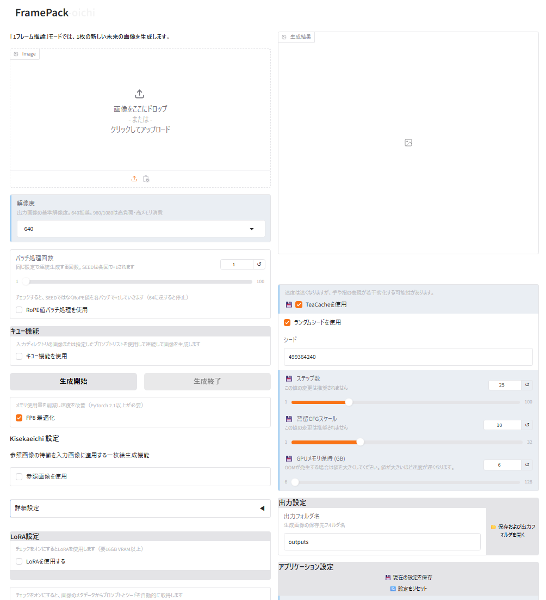

# FramePack-eichi | [日本語](../README.md) | [English](README_en.md) | [Русский](README_ru.md)
[](https://deepwiki.com/git-ai-code/FramePack-eichi)

FramePack-eichi 是基於 lllyasviel 的 [lllyasviel/FramePack](https://github.com/lllyasviel/FramePack) 分支，由 nirvash 的 [nirvash/FramePack](https://github.com/nirvash/FramePack) 開發的功能增強版本。在 nirvash 的開創性改進基礎上，增加了許多細緻的功能。此外，從 v1.9 開始，在 Kohya Tech 的許可下，引入了 [kohya-ss/FramePack-LoRAReady](https://github.com/kohya-ss/FramePack-LoRAReady) 的代碼，大幅提升了 LoRA 功能的性能和穩定性。

## 📘 名稱的由來

**Endframe Image CHain Interface (EICHI)**
- **E**ndframe: 強化和最佳化終端幀功能
- **I**mage: 改善關鍵幀圖像處理和視覺回饋
- **CH**ain: 複數的關鍵幀間的連接和關係的強化
- **I**nterface: 直感性的使用者體驗和 UI/UX 的提升

「eichi」是日本語的「睿智」（深刻的智慧、英知）的表達，代表著 AI 技術的進化和人間創造性的的融合，象征著本專案的哲學。
即~~現地~~**世界範圍內**叡智的差分幀製作改修規格。**叡智已經跨越海洋！**

感謝您 [https://github.com/hinablue](https://github.com/hinablue) **Hina Chen** 對多語言支援的協助。

## 🌟 功能擴展 (v1.9.4) ※正式發布版

**FramePack-eichi v1.9.4** 專注於使用便利性提升和穩定性改善。

### 🚀 主要新功能

- **設定保存功能**：彩色背景項目在下次啟動時自動復原
- **警報功能**：Windows系統生成完成時的聲音通知開關功能
- **張量處理強化**：透過新的張量相關模組提升處理能力
- **日誌管理系統**：標準輸出文件重定向功能與時間戳記日誌

### 💡 使用場景

- **高效工作流程**：設定保存功能無需重複設定作業
- **長時間作業**：警報功能可透過聲音確認生成完成
- **除錯作業**：日誌管理功能便於問題識別和解決

## 🌟 功能擴展 (v1.9.3)

**FramePack-eichi v1.9.3** 專注於工作流程效率和使用便利性的改進。

### 🚀 主要新功能

- **提示詞隊列**：從文本文件順序處理多個提示詞
- **圖像隊列**：自動順序處理文件夾中的圖像
- **FP8優化**：不使用LoRA時顯著減少內存使用（需要PyTorch 2.1+）
- **LoRA預設管理器**：輕鬆保存和切換多個LoRA配置
- **視頻時長擴展**：eichi(標準版)添加30秒、40秒選項，F1添加30秒/40秒/60秒/120秒
- **kisekaeichi集成**：由furusu設計、Kohya實現的基於參考圖像的視頻生成技術集成到oichi
- **添加俄語界面**：擴展至4語言支持（日語、英語、中文、俄語）

### 💡 使用場景

- **批量處理**：通過提示詞和圖像隊列一次處理多個生成任務
- **低配環境**：由於FP8優化，即使8GB VRAM也能舒適操作
- **國際化**：通過俄語界面支持，更多用戶可以使用該工具

## 🌟 FramePack-oichi 添加 (v1.9.2)

**FramePack-eichi v1.9.2**引入了一個新功能「FramePack-oichi」。這是一個從單一輸入圖像預測生成下一幀未來圖像的專用工具。



### 🤔 什麼是 FramePack-oichi?

- **單幀推論**：僅生成下一幀，而非整個視頻
- **輕量級處理**：比常規視頻生成更輕便快速，允許快速確認結果
- **用戶友好**：簡單的UI設計，即使初學者也能直觀操作
- **多語言支持**：完全支持日語、英語和繁體中文

### 💡 使用場景

- **創意探索**：快速查看「圖像可能如何移動」
- **資源節省**：與完整視頻生成相比，使用更少的資源處理
- **連續生成**：可以將生成的圖像作為輸入再次使用，構建多幀序列
- **kisekaeichi功能**：由furusu設計、Kohya實現的基於參考圖像的視頻生成技術（v1.9.3添加）

### 🚀 啟動方式

提供專用啟動腳本：
- 日語版：`run_oneframe_ichi.bat`
- 英語版：`run_oneframe_ichi_en.bat`
- 繁體中文版：`run_oneframe_ichi_zh-tw.bat`
- 俄語版：`run_oneframe_ichi_ru.bat`（v1.9.3新增）

## 🌟 F1 模型添加 (v1.9.1)

**FramePack-eichi v1.9.1** 在傳統的逆向生成模型「FramePack-eichi」（標準版）基礎上，添加了一個支持正向生成的新模型「FramePack-~~eichi~~ F1」。


### 🆚 F1 模型和標準模型的區別

| 特點 | F1 模型 | 標準模型 |
|------|----------|------------|
| 生成方向 | 正向生成（從首到尾） | 逆向生成（從尾到首） |
| 動作特點 | 動作更多，結果更直觀 | 可進行更精確的控制 |
| UI 元素 | 簡化設計 | 可使用詳細設定 |
| 易用性 | 適合初學者，更直觀 | 適合高級用戶，可進行複雜控制 |
| 關鍵幀 | 僅使用 Image | Image、Final、分段圖像 |
| 啟動方式 | run_endframe_ichi_f1.bat | run_endframe_ichi.bat |

### 💡 應該選擇哪一個？

- **初次使用或想要簡單操作的用戶** → 推薦使用 **F1 模型**
  - 更容易獲得自然流暢的動態效果
  - 設定項目較少，操作更直觀
  - 通過專用啟動腳本（`run_endframe_ichi_f1.bat`）使用

- **想要更高級控制或有經驗的用戶** → 推薦使用 **標準模型**
  - 可使用多個關鍵幀圖像進行細致控制
  - 可使用分段提示詞等高級功能
  - 通過傳統啟動腳本（`run_endframe_ichi.bat`）使用

**注意：** 首次啟動 F1 模型時，除了標準模型外，還會下載約 24GB 的額外模型。標準模型也會被保留，您可以在兩者之間切換使用。

### 多語言・多模式統合啟動器

**Language_FramePack-eichi.bat** 是一個統合啟動器，可以從單一界面啟動所有 FramePack-eichi 變體。

#### 啟動方法
1. 在 FramePack 根目錄執行 `Language_FramePack-eichi.bat`
2. 從菜單中選擇所需的編號並按 Enter 鍵

#### 可用選項
| 編號 | 說明 |
|---------|-----------|
| 1-4 | FramePack-Eichi endframe_ichi（日語、英語、中文、俄語） |
| 10-13 | FramePack-Eichi endframe_ichi_f1（日語、英語、中文、俄語） |
| 20-23 | FramePack-Eichi oneframe_ichi（日語、英語、中文、俄語） |
| 50-53 | 原版 FramePack（日語、英語、中文、俄語） |
| 60-63 | FramePack LoRA（日語、英語、中文、俄語） |

#### 資源庫連結
啟動器還提供快速存取以下內容：
- 官方 FramePack 資源庫
- FramePack-eichi 資源庫

## 🌟 主要功能

- **高品質影片生成**：從單一圖像生成自然流暢的影片 ※現有功能
- **隊列處理**：通過提示詞和圖像隊列進行自動批量處理 ※v1.9.3 新增
- **FP8優化（改進版）**：不使用LoRA時顯著減少內存使用 ※v1.9.3 新增
- **F1 模型支持**：支持正向生成的新模型，實現更直觀的影片創建 ※v1.9.1 新增
- **FramePack-oichi**：從單一輸入圖像生成下一幀未來圖像的新功能 ※v1.9.2 新增
- **kisekaeichi功能for oichi**：由furusu設計、Kohya實現的基於參考圖像的視頻生成技術集成到oichi ※v1.9.3 新增
- **靈活的影片長度設定**：支援 1-20 秒的各個區段模式 ※獨特功能
- **區段幀大小設定**：可切換 0.5 秒模式和 1 秒模式 ※v1.5 新增
- **全填充功能**：所有區段使用相同的填充值 ※v1.4 新增
- **多區段支援**：可在多個區段指定關鍵幀圖像，實現複雜動畫 ※nirvash 新增功能
- **區段專用提示詞設定**：可為每個區段指定獨立的提示詞 ※v1.2 新增
- **紅框/藍框關鍵幀圖像高效複製**：僅需兩個關鍵幀即可覆蓋所有區段 ※v1.7 新增
- **張量數據保存與合併**：可保存影片的潛在表示，並合併多個影片 ※v1.8 新增
- **提示詞管理功能**：輕鬆保存、編輯和重用提示詞 ※v1.3 新增
- **PNG 元數據嵌入**：自動記錄生成圖像中的提示詞、種子值和分段信息 ※v1.9.1 新增
- **Hunyuan/FramePack LoRA 支援**：通過模型自定義添加獨特表現 ※v1.9/v1.9.1 大幅改進
- **LoRA預設管理器**：保存和加載多個LoRA配置 ※v1.9.3 新增
- **視頻時長擴展**：eichi添加30秒、40秒選項，F1添加30秒/40秒/60秒/120秒 ※v1.9.3 新增
- **FP8 優化**：降低 LoRA 應用時的 VRAM 使用量並優化處理速度 ※v1.9.1 新增
- **MP4 壓縮設定**：可調整影片檔案大小與品質的平衡 ※v1.6.2 從主版本合併
- **輸出資料夾管理功能**：支援指定輸出資料夾和與作業系統無關的開啟方式 ※v1.2 新增
- **多語言支援（i18n）**：支援日語、英語、中文、俄語的 UI ※v1.8.1 新增，v1.9.3 新增俄語
- **Docker 支持**：在容器化環境中輕鬆運行 FramePack-eichi ※v1.9.1 新增


**分段設定畫面**


## 📚 相關文檔

- **[安裝指南](README_setup_zh.md)** - 詳細安裝說明
- **[使用指南](README_userguide_zh.md)** - 詳細使用說明
- **[配置信息](README_column_zh.md#%E6%80%A7%E8%83%BD%E8%A8%AD%E5%AE%9A)** - 詳細配置選項
- **[更新日誌](README_changelog.md)** - 完整更新歷史

## 📝 最新更新資訊 (v1.9.3)

### 主要變更

#### 1. 提示詞隊列和圖像隊列
- **提示詞隊列**：從文本文件加載多個提示詞並順序處理
- **圖像隊列**：自動順序處理指定文件夾中的圖像
- **自動處理**：啟用隊列時完成後自動處理下一項

#### 2. FP8優化改進
- **內存使用減少**：不使用LoRA時顯著減少內存使用
- **提高處理速度**：優化提高處理速度（需要PyTorch 2.1或更高版本）
- **默認啟用**：正常使用時FP8優化默認啟用

#### 3. LoRA預設管理器
- **多預設支持**：保存和管理最多5個預設
- **輕鬆切換**：從UI輕鬆切換預設
- **批量保存**：批量保存LoRA文件、強度和其他設置

#### 4. UI組織和多語言支持
- **邏輯分組**：將相關功能分組以提高可用性
- **增強說明**：為每個功能添加說明以便更好理解
- **添加俄語UI**：支持4種語言（日語、英語、中文、俄語）

#### 5. 視頻生成時長擴展
- **eichi（標準版）**：在1秒模式（33幀）中添加30秒、40秒選項
- **F1**：添加30秒、40秒、60秒、120秒選項
- **靈活製作**：支持更多樣的視頻長度，實現長視頻生成

#### 6. 分段管理增強
- **導入/導出路徑規範化**：導入/導出的路徑規範化
- **改進兼容性**：改進不同環境之間的分段信息兼容性

#### 7. kisekaeichi功能集成到oichi
- **參考圖像生成**：集成由furusu設計、Kohya實現的基於參考圖像的視頻生成技術
- **精確控制**：通過目標索引和歷史索引進行精確控制
- **遮罩功能**：實現僅更改特定區域的遮罩功能

#### 8. 錯誤修復和優化
- **提示詞處理修復**：修復提示詞添加和刪除問題
- **Windows錯誤避免**：避免與asyncio相關的Windows錯誤
- **模型下載器**：為F1模型添加高效下載功能

## 📝 更新資訊 (v1.9.2)

### 主要變更

#### 1. 「FramePack-oichi」新功能添加
- **下一幀預測**：從單一輸入圖像預測生成下一幀未來圖像的新功能
- **專用啟動腳本**：添加了`run_oneframe_ichi.bat`和其他語言版本
- **輕量便捷**：比常規視頻生成更輕便，可快速查看下一幀
- **完整多語言支持**：完全支持日語、英語和中文

#### 2. 幀圖像保存功能
- **幀保存選項**：添加保存所有生成幀圖像的選項
- **靈活選擇**：可選擇保存所有分段的所有幀或僅保存最終分段的幀
- **更易可視化**：使中間視頻過程的可視化和作為素材資源的使用更加容易

#### 3. 分段信息批量管理增強
- **ZIP文件批量下載**：添加了通過ZIP文件批量下載分段信息的功能
- **高效多項目管理**：更高效地管理和備份多個項目
- **批量上傳支持**：支持批量上傳開始圖像、結束圖像和分段信息（提示詞、圖像）

#### 4. LoRA功能增強
- **同時使用多個LoRA**：支持同時使用三個LoRA
- **目錄選擇默認**：默認從目錄選擇，能夠選擇/webui/lora文件夾中的LoRA
- **全模式支持**：在所有模式（標準版、F1版、oneframe版）中支持LoRA功能增強

#### 5. VAE緩存功能（基於furusu研究）
- **逐幀VAE解碼**：通過逐幀VAE解碼提高處理速度 - 基於[furusu的研究](https://note.com/gcem156/n/nb93535d80c82)和[FramePack實現](https://github.com/laksjdjf/FramePack)
- **靈活平衡調整**：可調整內存使用量和處理速度之間的平衡
- **輕鬆開關切換**：從設置屏幕簡單切換
- **無默認影響**：默認為關閉，因此除非啟用否則沒有影響
- **性能提升**：通過利用幀間獨立性的計算緩存實現高達30%的速度提升

## 📝 更新資訊 (v1.9.1)

### 主要變更

#### 1. F1 模型添加
- **新的正向生成模型**：引入了支持正常生成方向（從首到尾）的 "FramePack_F1_I2V_HY_20250503" 模型
- **簡化的界面**：F1 模型中移除了分段（關鍵幀圖像）和 Final（終端幀）功能
- **專用啟動腳本**：添加了 `run_endframe_ichi_f1.bat` 和多語言版本腳本
- **圖像影響度調整**：添加了控制首個分段中初始圖像變化程度的功能（可在 100.0% 至 102.0% 範圍內調整）

#### 2. 記憶體管理優化
- **增強的模型管理**：通過 `transformer_manager.py` 和 `text_encoder_manager.py` 實現高效記憶體管理
- **FP8 優化**：通過 8 位浮點格式減少 LoRA 應用時的 VRAM 使用量
- **RTX 40 系列 GPU 優化**：通過 `scaled_mm` 優化提升性能

#### 3. PNG 元數據功能
- **元數據嵌入**：自動在生成圖像中保存提示詞、種子值和分段信息
- **元數據提取**：能夠從保存的圖像中檢索設置
- **與 SD 工具兼容**：通過標準元數據格式實現與其他工具的兼容性

#### 4. 剪貼板支持增強
- **統一支持**：標準版的 Image 和 Final 以及 F1 版的 Image 均支持剪貼板功能

#### 5. 批量分段信息添加功能
- **ZIP 文件導入**：可通過 zip 文件批量設置分段圖像和提示詞
- **自動分段配置**：基於 zip 文件中的編號圖像和 YAML 配置文件自動設置
- **組合支持**：批量註冊起始幀、結束幀以及每個分段圖像和提示詞

#### 6. Docker 支持增強
- **容器化環境**：使用 Dockerfile 和 docker-compose.yml 實現簡單設置
- **多語言支持**：支持多種語言（日語、英語、中文）的容器鏡像

## 📝 更新資訊 (v1.9)

### 主要變更

#### 1. 導入 kohya-ss/FramePack-LoRAReady
- **LoRA 功能顯著改進**：在 Kohya Tech 許可下，提高了 LoRA 應用的穩定性和一致性
- **高 VRAM 模式和低 VRAM 模式統一**：兩種模式採用相同的直接應用方式
- **代碼複雜性降低**：通過使用共同的 `load_and_apply_lora` 函數提高可維護性
- **廢棄 DynamicSwap 掛鉤方法**：完全過渡到更穩定的直接應用方式

#### 2. 標準化為 HunyuanVideo 格式
- **LoRA 格式標準化**：統一為 HunyuanVideo 格式，提高不同格式之間的兼容性

## 📝 更新資訊 (v1.8.1)

### 主要變更

#### 1. 多語言支援（i18n）的實現
- **支援語言**：支援日語、英語、繁體中文三種語言
- **語言切換**：可通過以下執行檔切換語言
  - `run_endframe_ichi.bat` - 日語版（預設）
  - `run_endframe_ichi_en.bat` - 英語版
  - `run_endframe_ichi_zh-tw.bat` - 繁體中文版
- **UI 國際化**：按鈕、標籤、訊息等幾乎所有 UI 元素都已多語言化
- **顯示語言保存**：可通過命令行參數選擇語言（例如：`--lang en`）

## 📝 更新資訊 (v1.8)

### 主要變更

#### 1. 張量數據合併功能的添加
- **張量數據保存功能**：將生成的影片的潛在表示（張量數據）以 .safetensors 格式保存
- **張量數據合併**：將保存的張量數據合併到新生成影片的「後方（末尾）」

#### 2. VAE 解碼處理的優化
- **分塊處理方式的引入**：將大型張量分割成小塊進行高效處理
- **記憶體效率的提升**：通過 GPU 和 CPU 之間的明確數據移動，減少記憶體使用量
- **相容性的強化**：通過設備和類型的明確調整提高穩定性

#### 3. 中間檔案管理的改進
- **中間檔案的自動刪除**：自動檢測和刪除合併處理過程中生成的中間檔案
- **刪除檔案的 feedback**：明確顯示已刪除檔案的資訊

### MP4 合併處理的詳細說明

1. **自動合併流程**：當張量數據被合併時，對應的 MP4 影片也會自動合併
2. **中間處理檔案**：合併處理過程中會暫時生成「{檔案名稱}_combined_interim_{編號}.mp4」的中間檔案，處理完成後會自動刪除
3. **原始檔案的保存**：同時保存生成的原始影片檔案「{檔案名稱}.mp4」和合併影片「{檔案名稱}_combined.mp4」
4. **分塊處理的優化**：即使是大型 MP4 檔案也能高效處理，在控制記憶體使用量的同時實現高品質合併
5. **進度顯示**：合併處理過程中會在 UI 上顯示進度，可以確認處理進行到哪個階段

## 張量數據的使用方法

### 張量數據保存功能

1. 進行一般的影片生成設定（上傳圖像、輸入提示詞等）
2. 勾選 **「保存張量數據」** 核取方塊（在 UI 右側新增）
3. 點擊 **「開始生成」** 按鈕生成影片
4. 生成完成時，除了影片（.mp4）外，還會保存張量數據（.safetensors）
5. 保存的張量數據會以與原始影片相同的檔案名稱（副檔名不同）保存在輸出資料夾中

### 張量數據合併功能

1. 從 **「張量數據上傳」** 欄位上傳已保存的 .safetensors 檔案
2. 照常設定圖像和提示詞，點擊 **「開始生成」** 按鈕
3. 新影片生成後，會自動生成將上傳的張量數據合併到「後方（末尾）」的影片
4. 合併後的影片會以「原始檔案名稱_combined.mp4」的形式保存
5. 如果開啟了張量數據保存，合併後的張量數據也會被保存

### MP4 合併處理的詳細說明

1. **自動合併流程**：當張量數據被合併時，對應的 MP4 影片也會自動合併
2. **中間處理檔案**：合併處理過程中會暫時生成「{檔案名稱}_combined_interim_{編號}.mp4」的中間檔案，處理完成後會自動刪除
3. **原始檔案的保存**：同時保存生成的原始影片檔案「{檔案名稱}.mp4」和合併影片「{檔案名稱}_combined.mp4」
4. **分塊處理的優化**：即使是大型 MP4 檔案也能高效處理，在控制記憶體使用量的同時實現高品質合併
5. **進度顯示**：合併處理過程中會在 UI 上顯示進度，可以確認處理進行到哪個階段

### 應用場景

- **長時間影片的分割生成**：將超出 GPU 記憶體限制的長影片分成多個會話生成
- **影片的連續性**：跨越多個會話創建具有一致性的長影片
- **現有影片的擴展**：在之前生成的影片中添加新場景
- **實驗性生成**：保存幀，作為新生成的起點重複使用

### 終點和關鍵幀圖像的持續性問題（正在處理中）

部分用戶報告了以下問題，目前正在考慮對策：

- 生成中斷後重新開始生成時，終點和關鍵幀圖像可能不會被使用
- 刪除圖像後重新上傳可以解決問題，但在開始生成前很難發現問題
- 如果確認存在此問題，請關閉圖像後重新上傳
- 在 v1.5.1 中，已修改為在按下 Start 按鈕時明確重新獲取圖像

### Hunyuan LoRA對應情況

暫定對應狀態：

- 在 v1.6 中，LoRA 應用邏輯已統一，高 VRAM 模式和低 VRAM 模式使用相同的直接應用方式
- VRAM 管理的基準值已更改（60GB→100GB），使更多用戶可以在低 VRAM 模式下運行
- 使用時 VRAM 16GB 可能稍顯緊張，但處理本身比開始前的磁碟讀取時間更短。建議使用較多記憶體
- 也收到了一些關於在高 VRAM 電腦上無法正常運行的詢問，正在考慮進行根本性檢討

## 💻 安裝方法

### 必要條件

- Windows 10/11（Linux/Mac也可能支援基本功能）
- NVIDIA GPU（建議RTX 30/40/50系列，最低8GB VRAM）
- CUDA Toolkit 12.6（RTX 50系列建議CUDA 12.8）
- Python 3.10.x
- 最新版NVIDIA GPU驅動程式

#### 📍 RTX 50系列（Blackwell）使用者注意

RTX 50系列（RTX 5070Ti、RTX 5080、RTX 5090等）需要特殊設置：

- **CUDA**: 需要12.8或更高版本
- **PyTorch**: 2.7.0（CUDA 12.8相容版）
- **SageAttention**: 2.1.1（RTX 50系列最佳化版）
- **建議設置**: 請參考[詳細設置說明](README_setup_zh.md#rtx-50-系列blackwell設置)

※ Linux支援在v1.2得到加強，並添加了開啟功能，但部分功能可能有限制。

### 步驟

#### 安裝官方套件

首先需要安裝原始的FramePack。

1. 從[官方FramePack](https://github.com/lllyasviel/FramePack?tab=readme-ov-file#installation)下載Windows一鍵安裝包。
   點擊「Click Here to Download One-Click Package (CUDA 12.6 + Pytorch 2.6)」。

2. 解壓下載的套件，執行`update.bat`後再執行`run.bat`啟動。
   執行`update.bat`很重要。如果不執行，可能會使用包含潛在錯誤的舊版本。

3. 首次啟動時會自動下載所需模型（約30GB）。
   如果已有下載好的模型，請放置在`framepack\webui\hf_download`資料夾中。

4. 此時可以運行，但如果未安裝加速庫（Xformers、Flash Attn、Sage Attn），處理速度會較慢。
   ```
   Currently enabled native sdp backends: ['flash', 'math', 'mem_efficient', 'cudnn']
   Xformers is not installed!
   Flash Attn is not installed!
   Sage Attn is not installed!
   ```

   處理時間差異：※RAM:32GB、RXT4060Ti(16GB)的情況
   - 未安裝加速庫時：約4分46秒/25步驟
   - 安裝加速庫時：約3分17秒〜3分25秒/25步驟

5. 要安裝加速庫，請從[Issue #138](https://github.com/lllyasviel/FramePack/issues/138)下載`package_installer.zip`，解壓後在根目錄執行`package_installer.bat`（在命令提示字元中按Enter）。

6. 重新啟動確認加速庫是否安裝成功：
   ```
   Currently enabled native sdp backends: ['flash', 'math', 'mem_efficient', 'cudnn']
   Xformers is installed!
   Flash Attn is not installed!
   Sage Attn is installed!
   ```
   作者執行時，Flash Attn未安裝。
   注意：即使未安裝Flash Attn，對處理速度影響很小。測試結果顯示，Flash Attn的有無造成的速度差異很小，「Flash Attn is not installed!」狀態下約3分17秒/25步驟，與全部安裝時（約3分25秒/25步驟）幾乎相同。
   Xformers是否安裝影響最大。

#### 安裝FramePack-eichi

1. 將執行檔放置在 FramePack 的根目錄中：
   - `run_endframe_ichi.bat` - 標準版/日語用（預設）
   - `run_endframe_ichi_en.bat` - 標準版/英語用
   - `run_endframe_ichi_zh-tw.bat` - 標準版/繁體中文用
   - `run_endframe_ichi_f1.bat` - F1版/日語用（v1.9.1新增）
   - `run_endframe_ichi_en_f1.bat` - F1版/英語用（v1.9.1新增）
   - `run_endframe_ichi_zh-tw_f1.bat` - F1版/繁體中文用（v1.9.1新增）
   - `run_endframe_ichi_ru.bat` - 標準版/俄語用（v1.9.3新增）
   - `run_endframe_ichi_f1_ru.bat` - F1版/俄語用（v1.9.3新增）
   - `run_oneframe_ichi.bat` - 單幀推論/日語用（v1.9.2新增）
   - `run_oneframe_ichi_en.bat` - 單幀推論/英語用（v1.9.2新增）
   - `run_oneframe_ichi_zh-tw.bat` - 單幀推論/繁體中文用（v1.9.2新增）
   - `run_oneframe_ichi_ru.bat` - 單幀推論/俄語用（v1.9.3新增）

2. 將以下檔案和資料夾放在`webui`資料夾中：
   - `endframe_ichi.py` - 標準版主應用程式檔案
   - `endframe_ichi_f1.py` - F1版主應用程式檔案（v1.9.1新增）
   - `oneframe_ichi.py` - 單幀推論版主應用程式檔案（v1.9.2新增）
   - `eichi_utils` 資料夾 - 工具模組
     - `__init__.py`
     - `frame_calculator.py` - 幀大小計算模組
     - `keyframe_handler.py` - 關鍵幀處理模組
     - `keyframe_handler_extended.py` - 關鍵幀處理模組
     - `preset_manager.py` - 預設管理模組
     - `settings_manager.py` - 設定管理模組
     - `tensor_combiner.py` - 張量合併模組（v1.8新增）
     - `ui_styles.py` - UI樣式定義模組（v1.6.2新增）
     - `video_mode_settings.py` - 影片模式設定模組
     - `png_metadata.py` - PNG元數據模組（v1.9.1新增）
     - `text_encoder_manager.py` - 文本編碼器管理模組（v1.9.1新增）
     - `transformer_manager.py` - 轉換器模型管理模組（v1.9.1新增）
     - `section_manager.py` - 分段信息管理模組（v1.9.2新增）
     - `vae_cache.py` - VAE緩存模組（v1.9.2新增）
     - `README_vae_cache.md` - VAE緩存功能說明（v1.9.2新增）
     - `lora_preset_manager.py` - LoRA預設管理模組（v1.9.3新增）
     - `model_downloader.py` - 模型下載功能（v1.9.3新增）
     - `vae_settings.py` - VAE設定管理模組（v1.9.3新增）
   - `lora_utils` 資料夾 - LoRA相關模組
     - `__init__.py`
     - `dynamic_swap_lora.py` - LoRA管理模組（為兼容性保留）
     - `lora_loader.py` - LoRA載入模組
     - `lora_check_helper.py` - LoRA應用狀態確認模組
     - `lora_utils.py` - LoRA狀態字典合併和轉換功能（v1.9新增）
     - `fp8_optimization_utils.py` - FP8優化功能（v1.9.1新增）
   - `diffusers_helper` 資料夾 - 模型記憶體管理改進工具
     - `memory.py` - 提供記憶體管理功能
     - `bucket_tools.py` - 解析度桶功能（v1.9.1新增）
     - **注意**：此目錄替換原始工具的源文件，請根據需要進行備份
   - `locales` 資料夾 - 多語言支援模組
     - `i18n.py` - 國際化（i18n）功能的核心實現
     - `i18n_extended.py` - 擴展國際化功能（v1.9.1新增）
     - `ja.json` - 日語翻譯檔案（預設語言）
     - `en.json` - 英語翻譯檔案
     - `zh-tw.json` - 繁體中文翻譯檔案
     - `ru.json` - 俄語翻譯檔案（v1.9.3新增）

3. 執行所需版本和語言的執行檔，FramePack-eichi 的 WebUI 將以對應設定啟動：
   - 標準版/日語：`run_endframe_ichi.bat`
   - 標準版/英語：`run_endframe_ichi_en.bat`
   - 標準版/繁體中文：`run_endframe_ichi_zh-tw.bat`
   - 標準版/俄語：`run_endframe_ichi_ru.bat`（v1.9.3新增）
   - F1版/日語：`run_endframe_ichi_f1.bat`（v1.9.1新增）
   - F1版/英語：`run_endframe_ichi_en_f1.bat`（v1.9.1新增）
   - F1版/繁體中文：`run_endframe_ichi_zh-tw_f1.bat`（v1.9.1新增）
   - F1版/俄語：`run_endframe_ichi_f1_ru.bat`（v1.9.3新增）

   或者，也可以從命令行直接指定語言啟動：
   ```bash
   python endframe_ichi.py --lang en  # 以標準版/英語啟動
   python endframe_ichi_f1.py --lang zh-tw  # 以F1版/繁體中文啟動
   ```

#### Docker 安裝
FramePack-eichi 可以通過 Docker 輕鬆設置，在不同系統之間提供一致的環境。

##### Docker 安裝前提條件
- 系統已安裝 Docker
- 系統已安裝 Docker Compose
- NVIDIA GPU（至少 8GB VRAM，推薦 RTX 30/40 系列）

##### Docker 設置步驟
1. **語言選擇**:
   Docker 容器默認以英文啟動。您可以通過修改 `docker-compose.yml` 中的 `command` 參數來更改：
   ```yaml
   # 日文：
   command: ["--lang", "ja"]
   
   # 繁體中文：
   command: ["--lang", "zh-tw"]
   
   # 英文（默認）：
   command: ["--lang", "en"]
   ```

2. **構建並啟動容器**:
   ```bash
   # 構建容器（首次或 Dockerfile 更改後）
   docker-compose build
   
   # 啟動容器
   docker-compose up
   ```
   
   要在後台運行（分離模式）：
   ```bash
   docker-compose up -d
   ```

3. **訪問 Web 界面**:
   容器運行後，通過以下地址訪問 Web 界面：
   ```
   http://localhost:7861
   ```

4. **首次運行注意事項**:
   - 首次運行時，容器將下載必要的模型（約 30GB）
   - 初始啟動期間可能會看到「h11 錯誤」（請參閱故障排除部分）
   - 如果您已經下載了模型，請將它們放在 `./models` 目錄中

#### Linux安裝方法

在Linux上，可以按照以下步驟執行：

1. 下載並放置上述必要檔案和資料夾。
2. 在終端機中執行以下命令：
   ```bash
   python endframe_ichi.py
   ```

#### Google Colab 安裝方法

- 請參考 [在 Google Colab 上試用 FramePack](https://note.com/npaka/n/n33d1a0f1bbc1)

#### Mac(mini M4 Pro) 安裝方法

- 請參考 [在 Mac mini M4 Pro 上運行熱門的 FramePack](https://note.com/akira_kano24/n/n49651dbef319)

## 🚀 使用方法

### 基本動畫生成　※既存功能

1. **上傳圖片**: 「Image」 框中上傳圖片
2. **輸入提示詞**: 輸入角色動作提示詞
3. **設定調整**: 調整動畫長度和種子值
4. **開始生成**: 「開始生成」 按鈕點擊

### 高級設定

- **生成模式選擇**:　※獨自功能
  - **通常模式**: 一般動畫生成
  - **循環模式**: 最終幀返回最初幀的循環動畫
    - **注意**: 由於技術限制，目前的循環功能可能難以創建完全無縫的循環
    - **推薦替代方案**: 如需高品質循環，建議使用 [FramePackLooP](https://github.com/red-polo/FramePackLoop)

- **所有邊距選擇**:　※v1.4 添加、此值越小1次會動畫越激烈
  - **所有邊距**: 所有區段使用同一邊距值
  - **邊距值**: 0~3 的整數值

- **影片長度設定**：※獨有功能的擴展
  - **1～20秒**

  [繼續閱讀](README_column_zh.md#-%E9%80%B2%E9%9A%8E%E8%A8%AD%E5%AE%9A)

## 🛠️ 配置資訊

### FP8 優化設定 (v1.9.1)

- **FP8 優化**: 使用 8 位浮點格式降低 LoRA 應用時的 VRAM 使用量
- **RTX 40 系列 GPU**: 通過 scaled_mm 優化加速
- **預設為關閉**: 啟用時可在低 VRAM 環境下更易使用 LoRA

### 語言設定

1. **通過執行檔選擇語言**:
   - `run_endframe_ichi.bat` - 標準版/日語（預設）
   - `run_endframe_ichi_en.bat` - 標準版/英語
   - `run_endframe_ichi_zh-tw.bat` - 標準版/繁體中文
   - `run_endframe_ichi_ru.bat` - 標準版/俄語
   - `run_endframe_ichi_f1.bat` - F1版/日語
   - `run_endframe_ichi_en_f1.bat` - F1版/英語
   - `run_endframe_ichi_zh-tw_f1.bat` - F1版/繁體中文
   - `run_endframe_ichi_f1_ru.bat` - F1版/俄語

2. **通過命令行指定語言**:
   ```bash
   python endframe_ichi.py --lang en  # 以標準版/英語啟動
   python endframe_ichi_f1.py --lang zh-tw  # 以F1版/繁體中文啟動
   ```

## 🔧 故障排除

### 關於 h11 錯誤

當您首次啟動該工具並匯入圖像時，您可能會遇到許多類似以下的錯誤：
*控制台中將顯示錯誤，且 GUI 中不會顯示任何影像。

**大多數情況下，圖片其實已經上傳了，只是縮圖顯示不正常，所以還是可以產生影片的。 **


```
ERROR:    Exception in ASGI application
Traceback (most recent call last):
  File "C:\xxx\xxx\framepack\system\python\lib\site-packages\uvicorn\protocols\http\h11_impl.py", line 404, in run_asgi
```
當處理 HTTP 回應時出現問題時，會顯示此錯誤。
如上所述，這通常發生在啟動過程的早期，即 Gradio 尚未完成啟動時。

解決方案：
  1. 刪除有「X」按鈕的圖片，然後重新嘗試上傳。
  2. 如果上傳同一文件重複失敗：
    - 完全停止 Python 進程，然後重新啟動應用程式
    - 重新啟動電腦，然後重新啟動應用程式

如果錯誤仍然存在，請嘗試其他圖片檔案或減小圖片大小。

### 記憶體不足錯誤

在 Windows 系統中，如果顯示「CUDA out of memory」或「RuntimeError: CUDA error」，請按照以下步驟操作：

1. `gpu_memory_preservation` 的值設定為 12-16GB
2. 關閉其他使用 GPU 的應用程式
3. 重新啟動應用程式
4. 降低圖片解析度（640x640 附近）

### 記憶體消耗的詳細分析

根據對整個源代碼的詳細分析，實際記憶體消耗如下：

#### 基本模型配置和加載時的記憶體消耗

- **transformer** (FramePackI2V_HY)：約 25-30GB（狀態字典完全展開時）
- **text_encoder**, **text_encoder_2**, **vae** 總計：約 8-10GB
  v1.9.1 添加了卸載處理來減少 RAM 使用量
- **其他輔助模型** (image_encoder等)：約 3-5GB
- **基礎 RAM 消耗總計**：約 36-45GB

#### LoRA 應用時的記憶體消耗模式

LoRA 應用處理流程：
1. **原始狀態字典**：約 25-30GB（transformer 大小）
2. **LoRA 文件加載**：50MB 至 500MB
3. **合併處理期間**：由於需要複製原始狀態字典並與 LoRA 合併，臨時需要額外 25-30GB
   注意：v1.9.1 重新審視了此過程，大幅降低了 RAM 消耗
4. **應用過程的峰值**：基本消耗 + 狀態字典複製 ≈ 約 70-90GB

**重要**：這種顯著的記憶體消耗增加僅發生在初次 LoRA 加載時。當加載不同的 LoRA 文件或更改 LoRA 應用強度或 FP8 設置時，不會發生這種大型記憶體峰值。初次加載後的正常視頻生成操作中，記憶體使用量維持在基本消耗水平（約 36-45GB）。

#### 推薦系統要求

- **標準執行 RAM 要求**：36-45GB
- **LoRA 應用期間的臨時峰值**：70-90GB
- **推薦頁面文件**：與 RAM 總計至少應為 40GB
  
例如：
- 32GB RAM 系統 → 頁面文件約 40GB
- 64GB RAM 系統 → 頁面文件約 20GB

#### 使用 F1 模型時的額外記憶體要求

使用 F1 模型時，除標準模型外，還需以下額外記憶體：
- **F1 模型初次下載**：約 24GB
- **兩種模型共存時的存儲容量**：約 54GB

#### Google Colab 等無交換空間環境注意事項

在無交換記憶體的環境中運行有很嚴格的限制：
- RAM 限制（13-15GB）使得即使加載基本模型也很困難
- 無法處理 LoRA 應用時所需的 70-90GB 臨時記憶體峰值
- 沒有交換空間，記憶體不足時系統會立即崩潰出現 OOM 錯誤

### 影片顯示問題

產生的影片在某些瀏覽器（尤其是 Firefox）和 macOS 上無法顯示：

- 症狀：影片無法在 Gradio UI 中顯示，縮圖無法在 Windows 上顯示，無法在某些播放器上播放
- 原因：`\framepack\webui\diffusers_helper\utils.py` 中的視訊編解碼器設定有問題

**此問題已透過合併原始 MP4 壓縮功能解決**

## 🤝 謝辞

本項目基於以下項目的貢獻：

- [lllyasviel/FramePack](https://github.com/lllyasviel/FramePack) - 感謝原作者 lllyasviel 的精湛技術與創新
- [nirvash/FramePack](https://github.com/nirvash/FramePack) - 感謝 nirvash 的開創性改進和擴展

## 📄 許可證

本項目遵循 [Apache 許可證 2.0](LICENSE) 發布。這與原 FramePack 專案的授權一致。


## 📝 更新日誌

最新的更新資訊如下所示。完整的更新歷史請參考[更新日誌](README_changelog.md)。

### 2025-05-15：版本 1.9.3
- **提示詞隊列和圖像隊列**：添加了批量處理的自動化功能
- **FP8優化改進**：大幅改善了不使用LoRA時的內存使用量和處理速度
- **LoRA預設管理器**：可以輕鬆保存和切換多個LoRA配置
- **UI組織**：通過邏輯分組和詳細說明提高了易用性
- **添加俄語UI**：擴展至4語言支持（日語、英語、中文、俄語）
- **視頻生成時長擴展**：eichi(標準版)添加30秒、40秒，F1添加30秒/40秒/60秒/120秒
- **kisekaeichi oichi集成**：將furusu設計、Kohya實現的參考圖像視頻生成技術集成到oichi
- **分段管理增強**：導入/導出時的路徑規範化
- **錯誤修復**：修復了提示詞處理和Windows環境錯誤

### 2025-05-11：版本 1.9.2
- **「FramePack-oichi」新功能添加**：
  - 從單一輸入圖像預測生成下一幀未來圖像的新功能
  - 添加專用啟動腳本（`run_oneframe_ichi.bat`等）
  - 比常規視頻生成更輕便，可快速查看下一幀
  - 完全支持多語言（日語、英語、中文）
- **幀圖像保存功能**：
  - 添加保存所有生成幀圖像的選項
  - 可選擇保存所有分段的所有幀或僅保存最終分段的幀
  - 使中間視頻過程的可視化和作為素材資源的使用更加容易
- **分段信息批量管理增強**：
  - 添加了通過ZIP文件批量下載分段信息的功能
  - 更高效地管理和備份多個項目
  - 支持批量上傳開始圖像、結束圖像和分段信息並在內容修改後重新下載
- **LoRA功能增強**：
  - 支持同時使用三個LoRA
  - 默認從目錄選擇，能夠選擇/webui/lora文件夾中的LoRA
  - 在所有模式（標準版、F1版、oneframe版）中支持LoRA功能增強
- **VAE緩存功能**：
  - 通過逐幀VAE解碼提高處理速度 - 基於furusu研究 [詳情1](https://note.com/gcem156/n/nb93535d80c82) [詳情2](https://github.com/laksjdjf/FramePack)
  - 可調整內存使用量和處理速度之間的平衡
  - 從設置屏幕簡單切換開/關
  - 默認為關閉，因此沒有影響
  - 通過利用幀間獨立性的計算緩存實現高達30%的速度提升

### 2025-05-04：版本 1.9.1
- **F1 模型添加**：引入了支持正向生成的新模型 "FramePack_F1_I2V_HY_20250503"
- **記憶體管理優化**：通過 transformer_manager.py 和 text_encoder_manager.py 實現高效模型管理
- **Docker 支持增強**：在容器化環境中實現簡單設置
- **PNG 元數據功能**：自動在生成圖像中嵌入提示詞、種子值和分段信息
- **最佳解析度桶系統**：根據縱橫比自動選擇最佳解析度
- **剪貼板支持增強**：支持標準版的 Image 和 Final 以及 F1 版的 Image 的剪貼板功能

---
**FramePack-eichi** - 端幀圖片連結口
旨在實現更直覺、更靈活的影片生成
