# FramePack-oichiなんとなく理解ガイド：あの謎パラメータたちとゆる～く仲良くなろう

## はじめに：なんか色々設定あるけど...よくわからないよね？

FramePack-oichiを使おうとすると、なんか色々な設定があるよね...

- **ターゲットインデックス**(target_index)って何？ 数字いじったら何か変わるの？
- **履歴インデックス**(history_index)って何の履歴？ 検索履歴？
- **RoPE値** (latent_window_size)って何のサイズ？ ブラウザの窓？
- **レイテントインデックス**(latent_index)って何の番号？ 順番待ち？
- **clean Latents**って掃除？ 何がキレイになるの？

まあ、細かいことはよくわからないけど、とりあえず**1フレーム推論と着せ替えができればいいよね**という感じで、ゆる～く理解していきましょう♪


## その1：なんか色々あるパラメータたち

### target_index（ターゲット…なんとかさん…）

#### 🤔 「この数字何？変えたら何か起こるの？」

**ふんわり説明**:
なんか、元の画像からどのくらい変化させるかを決める数字らしいです。小さいとあんまり変わらないし、大きいと結構変わります。

**🎯 1フレーム推論での特別な意味**:
1フレーム推論では、target_indexは潜在空間（AI内部の数字世界）での「位置指定」として機能するんだ。動画推論とは根本的に異なり、単一画像の品質制御に特化した役割を果たしているよ。

**フレーム進行と target_index の関係**:

<div style="width: 100%; overflow-x: auto; margin: 1em 0;">

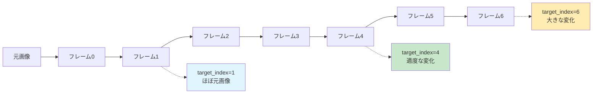

</div>

**ちょっと詳しい話**:
何やら難しい仕組みがあるらしいけど、要するに「変化の度合い調整ダイヤル」みたいなものですね。

---

### 🔬 技術者向け詳細解説：target_indexの数学的基盤

#### FramePack(HunyuanVideo)におけるtarget_indexの実装原理

target_indexは、FramePack(HunyuanVideo)の時間軸latent（※AIの内部数字）配列内での位置指定パラメータとして機能し、以下の技術的制約下で動作します：

**1. Causal制約の数学的定義**
```python
# oneframe_ichi.py:1233-1235の実装
max_latent_index = RoPE値 (latent_window_size) - 1  # デフォルト8 (latent_window_size=9)
target_index_actual = min(target_index, max_latent_index)
latent_indices[:, 0] = target_index_actual
```

**2. 実装での動作**
実際のコードでは、target_indexがlatent_indices配列の最初の要素（0番目）に設定されます。RoPE値 (latent_window_size)の上限（デフォルト8、latent_window_size=9時）を超えないよう制限されています。

**3. 具体的な機能**
target_indexは、oneframe_ichi.py:1233-1235の実装で、latent_indices配列の最初の要素（0番目）に設定されます。詳細な動作原理については、実装コードからは確認できていません。~~雰囲気で実装してしまったので。~~

**4. 1フレーム推論と動画推論の違い**
- **動画推論**: 時系列的な一貫性が最優先、フレーム間の関係性を重視
- **1フレーム推論**: 単一画像の品質制御、着せ替え機能（kisekaeichi）に特化
- **制御範囲**: 1フレーム推論では0-8（latent_window_size=9時）に制限

**5. 実証値4-6の経験的根拠**
コミュニティでの経験的な使用により「target_index=1はあまり良くない」「target_index=4-6が良好」という傾向が報告されています。これらは実際の使用に基づく経験値です。

**6. FramePack(HunyuanVideo)の末尾フレーム特殊処理との関係**
FramePackの基盤となるHunyuanVideoでは末尾フレームが特殊な1倍展開処理（他は4倍展開）を受けるため、target_indexの位置により異なる圧縮特性の影響を受ける可能性があります。

**7. oichiでの統合制御**
oichiでは、target_index、history_index、latent_indexの3つのパラメータが連携して動作し、1フレーム推論および着せ替え処理の品質向上に寄与しています。特に着せ替え（kisekaeichi）機能では、これらのパラメータが参照画像との適切な融合を制御する重要な役割を担っています。

---
#### 💡 「で、結局何にすればいいの？」

「clean latentsと各indexに何を渡すか」を適当に操作して望みの結果を得る、というシンプルな考え方がいいらしいよ。

**なんとなくの目安**:
- **target_index=1**: ほとんど変わらない（ちょっと物足りない）
- **target_index=4-6**: いい感じに変わる（これがおすすめ♪）
- **target_index=8**: 変わりすぎて別人になっちゃうかも

**実用的な調整方法**：
1. まずデフォルト値で試す
2. 結果を見て「もっと変化が欲しい」→数値を上げる
3. 「変化しすぎ」→数値を下げる
4. 繰り返して理想の結果を探す

**⚠️ 注意**: target_index=4-6という推奨値は一般的に使用されている経験則ですが、具体的な実証データの詳細は確認が必要です。LoRA使用時に特別な指定があれば、そちらに従ってくださいね。

### history_index（履歴…なんとかさん…）

#### 🤔 「履歴って言われても...？」

**ふんわり説明**:
AIが絵を描く時に「前の情報をどのくらい覚えておくか」みたいな設定らしいです。記憶力の良さを決める感じ？

<div style="width: 100%; overflow-x: auto; margin: 1em 0;">

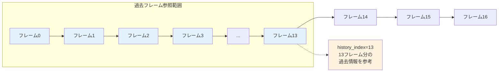

</div>

**ちょっと詳しい話**:
何やら複雑な仕組みで品質を保つための設定だそうです。まあ、よくわからないけど大事らしい。

---

### 🔬 技術者向け詳細解説：history_indexの双方向参照制御理論

#### FramePack(HunyuanVideo)のAnti-drifting Samplingにおけるhistory_indexの役割

history_indexは、FramePack(HunyuanVideo)のAnti-drifting sampling（※品質劣化防止技術）機構において、参照フレーム制御を担うパラメータです：

**1. Anti-drifting Samplingでの役割**
history_indexは、Anti-drifting sampling機構において参照範囲を制御するパラメータです。従来の因果的サンプリングと比較して品質劣化を抑制する効果があります。

**2. Causal制約下での最適化**
history_indexは、target_indexとの関係で制約を受けます：
```
target_index ≤ history_index  # Causal制約
history_index ≤ RoPE値 (latent_window_size)  # メモリ制約
```

**3. 13という推奨値の経験的背景**
history_index=13という値は、コミュニティでの実際の使用において、メモリ効率と品質のバランスが良好とされる経験値です。詳細な理論的根拠については、実装からは確認できていません。まだまだ経験則がとても貴重で大切な段階です。

**4. 品質劣化防止メカニズム**
history_indexによる品質保持は、過去フレームへの参照により実現されますが、具体的なアルゴリズムは実装の詳細に依存します。~~これも雰囲気で実装してしまったのでブラックボックスです。~~

**5. 過去フレーム生成の現状について**
正直にお伝えしますと、「過去フレームはどうやって作られるのか」については、理解不足です。

**推測される可能性**：
- **遡行生成**: 現在フレームから逆算して過去フレームを推定
- **補間生成**: 既存フレーム間を数学的に補間
- **潜在空間復元**: latent spaceでの逆変換処理

これらはあくまで推測に過ぎません。~~誰かご教授いただけると幸いです。~~

**実用上の重要なポイント**：
過去フレーム生成の詳細メカニズムが不明でも、history_index=13という実証値により安定した品質が得られることは確認されています。技術の進歩とともに、この謎も解明されることを期待しましょう。

---
#### 💡 「結局何にすればいいの？」

**なんとなくの答え**:
コミュニティで「13がいいよ～」と推奨されているので、13にしておけば安心です。今のところは深く考えなくて大丈夫♪自分で微調整するのもよいですね。

### RoPE値 (latent_window_size)（ウィンドウ...サイズ？）

#### 🤔 「窓のサイズって何の話？」

**ふんわり説明**:
AIが一度にどのくらいの量のフレーム（動画のコマ）を処理するかの設定です。窓から外を見る時の窓の大きさみたいなもので、大きい窓なら一度にたくさん見えるけど、小さい窓なら少しずつしか見えない感じ。

**💡 RoPEって何？**: 
RoPE = **Ro**tary **P**osition **E**mbedding（回転位置エンコーディング）の略です。AIが「どこの位置の情報か」を覚えるための技術の名前だそうです。

昔のAIは「順番」を覚えるのがちょっと苦手だったんです。でもRoPEは「くるくる回転」という面白い方法で、「これは何番目にあるのか」を上手に覚えられるようになったそうです。なんか数学っぽくて難しそうですが、要は「位置を覚える新しいやり方」ですね。

**ウィンドウ処理の仕組み**:

<div style="width: 100%; overflow-x: auto; margin: 1em 0;">

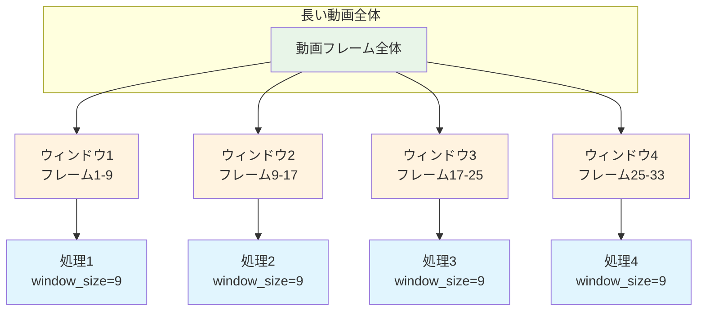

</div>

**ちょっと詳しい話**:
メモリを効率よく使うための工夫だそうです。9がちょうどいいバランスらしい。

---

### 🔬 技術者向け詳細解説：RoPE値 (latent_window_size)の技術的役割

#### メモリ効率化の基本原理

RoPE値 (latent_window_size)は、FramePackのメモリ効率化機構の重要なパラメータです：

**1. メモリ使用量の制御**
RoPE値 (latent_window_size)は、一度に処理するフレーム数を制限することでメモリ使用量を制御します。従来の動画生成ではフレーム数に比例してメモリが必要でしたが、FramePackではウィンドウサイズで上限が決まります。

**2. ウィンドウベース処理**
FramePackでは、長い動画を小さなウィンドウに分割して順次処理することで、メモリ効率を向上させています。

**3. effective_window_size（有効ウィンドウサイズ）との関係**
effective_window_size（※実際に使用されるウィンドウサイズ）は、RoPE値 (latent_window_size)の範囲内で設定される実際の処理サイズです：

実際の生成フレーム数は `effective_window_size * 4 - 3` で計算されます。
- effective_window_size=9 → 33フレーム生成

**4. 3Dパッチ化カーネルとの関係**
FramePackでは、ウィンドウ内のフレームに対して異なる解像度のカーネルが適用されます：
- (1,2,2): 1536トークン（最高品質）
- (2,4,4): 384-768トークン（中品質）
- (4,8,8): 192トークン（低品質）

**5. 9というデフォルト値の背景**
RoPE値 (latent_window_size)=9の選択は、メモリ効率、品質、計算効率のバランスを考慮した結果です。この値は**FramePack-oichiでは最大64**まで設定可能ですが、基本的には変更推奨されないパラメータです。特に一般的なGPU（6-12GB VRAM）での安定動作が確認されています。

**6. 1フレーム推論での特化設定**
1フレーム推論では動画特有のlatent_window_sizeの大きな値は不要で、メモリ効率とUIレスポンスの観点から9が最適化された値として選択されています。

**処理時間への影響**:
理論的にはRoPE値の増加により計算量が大幅に増加しますが、実際の処理時間増加は限定的です。VAE処理やその他の処理がボトルネックとなり、RoPE値を少し増やしても「ちょっとずつ」の範囲での時間増加に留まることが多いです。

**RoPE値バッチ処理について**:
FramePack-eichiには、RoPE値を段階的に増加させながら複数枚の画像を生成するバッチ処理機能があります。例えば「RoPE値9から始めて+1ずつ増加」のような設定が可能です。これにより、同じ入力画像から異なる「未来予測範囲」に基づく複数のバリエーション画像を自動生成できます。RoPE値が変わることで、AIの「どこまで先を見越して判断するか」が変化し、結果として微妙に異なる表現の画像が生成されます。

---
#### 💡 「で、何にすればいいの？」

**なんとなくの答え**:
- **小さすぎる**: なんか変になる
- **大きすぎる**: パソコンが重くなる
- **9**: ちょうどいい（みんなこれ使ってる）

### latent_index（レイテント…なんとかさん…）

#### 🤔 「インデックスって何？番号？」

**ふんわり説明**:
AIがフレーム処理をする時の「スタート地点」を決める番号です。0から始まって、どの位置から処理を始めるかを指定します。

**レイテント処理の流れ**:

<div style="width: 100%; overflow-x: auto; margin: 1em 0;">

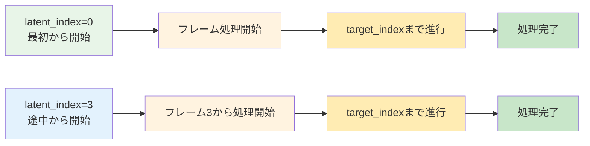

</div>

**ちょっと詳しい話**:
普通は0（最初から）で問題ないですが、特定の処理で途中から始めたい時に変更することがあるそうです。

---

### 🔬 技術者向け詳細解説：latent_indexの処理開始点制御

#### フレーム処理開始位置の技術的意味

latent_indexは、1フレーム推論での内部配列位置を指定するパラメータです：

**1. 1フレーム推論での配列位置指定**
latent_indexは、1フレーム推論において内部配列での位置を指定しますが、実際はsample_num_frames=1が固定設定されているため、常に単一フレームのみが処理されます。「9×4-3=33フレーム」の計算は動画推論用であり、oichiでは適用されません。

**2. oichiでの重要性**
oichiでは、latent_index=0が推奨設定として使用されています。これは着せ替え処理において、フレーム配列の先頭から処理を開始することで安定した結果を得るためです。

**3. 処理フローへの影響**
latent_indexの値により、clean Latents処理の適用範囲や、target_indexとの相対的な関係が決定されます。

**4. 実装での制約**
latent_indexは、effective_window_size以下の値である必要があり、target_indexとの整合性も考慮する必要があります。

---
#### 💡 「結局何にすればいいの？」

**なんとなくの答え**:
ほとんどの場合は**0**で大丈夫です。特別な理由がない限り、変更する必要はありません♪

### clean Latents（クリーン…なんとかさん…）

#### 🤔 「掃除？何をキレイにするの？」

**ふんわり説明**:
AIが絵を描く時に、あのLatent（AIの頭の中の数字）がちょっとずつズレちゃうらしいんです。それを直してくれる「お掃除機能」みたいなもの。

**例え話**:

<div style="width: 100%; overflow-x: auto; margin: 1em 0;">

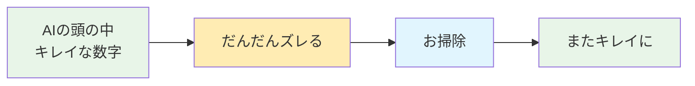

</div>

お部屋の掃除みたいに、AIの頭の中もお掃除が必要なんですね。

**clean Latents お掃除プロセス**:

<div style="width: 100%; overflow-x: auto; margin: 1em 0;">


</div>

**ちょっと詳しい話**:
3段階でお掃除してくれるシステムがあるそうです。細かい仕組みはよくわからないけど、とにかくキレイになります。

---

### 🔬 技術者向け詳細解説：clean Latentsの技術的役割

#### 多段階品質制御システム

clean Latentsは、FramePackの品質保持システムであり、multi-scale処理による階層的制御を行います：

**1. 1フレーム推論での特化処理構造**
clean Latentsは、1フレーム推論（oichi）では動画推論とは異なる役割を果たします：

**重要な違い**：
- **動画推論**: `effective_window_size × 4 - 3`による複数フレーム処理
- **1フレーム推論**: `sample_num_frames = 1`固定、常に単一フレームのみ

**1フレーム推論でのclean Latentsの役割**：
- **空間的品質向上**: 時系列の品質劣化がないため、空間的な細部品質に特化
- **着せ替え品質制御**: kisekaeichi処理での参照画像との融合品質向上
- **ノイズ除去と細部調整**: 単一フレーム内での精密な品質管理

**処理段階の種類**：
- **2x**: 中解像度でのlatent品質制御
- **4x**: 高解像度でのlatent品質制御  
- **post**: 最終段階での品質調整とノイズ除去

**2. 1フレーム推論でのFramePack(HunyuanVideo)活用**
1フレーム推論では、FramePack(HunyuanVideo)の動画生成機能を`T=1`（フレーム数=1）で単一画像生成に特化して活用しています：

**技術的変換**：
- **入力テンソル**: T×C×H×W → 1×C×H×W（T=1固定）
- **Binary Mask**: 最初の1フレームのみ有効化 [1, 0, 0, 0, ...]
- **3D VAE処理**: 時間軸圧縮なしで空間軸のみ圧縮
- **RoPE 3D**: 時間軸の位置エンコーディングは単一位置のみ

**3. oichiでの品質最適化**
oichiでは、clean Latentsの全段階（2x、4x、post）を有効にすることで、特に着せ替え（kisekaeichi）処理での細部品質が大幅に向上します。単一フレーム内での精密な品質管理により、安定した高品質出力を実現しています。

---
#### 💡 「2x、4x、postって何？」

**お掃除の種類**:
- **2x**: 中解像度でのlatent品質制御（768トークン相当）
- **4x**: 高解像度でのlatent品質制御（384トークン相当）  
- **post**: 最終段階での品質調整とノイズ除去

**🎯 1フレーム推論での重要性**:
1フレーム推論では常にsample_num_frames=1で単一フレームのみを処理するため、clean Latentsの役割は時系列品質劣化防止ではなく、空間的な品質向上に特化しています。全段階を有効にすることで、特に着せ替え（kisekaeichi）処理での細部品質が大幅に向上します♪

---

### 🔗 参考情報：関連プロジェクトと実装バリエーション

#### 実装プロジェクト一覧
現在、FramePackの1フレーム推論および着せ替えは複数のプロジェクトで実装・拡張されています：

**主要実装**：
- **[musubi-tuner](https://github.com/kohya-ss/musubi-tuner)**: 学習機能拡張版
- **[ComfyUI-FramePackWrapper_PlusOne](https://github.com/tori29umai0123/ComfyUI-FramePackWrapper_PlusOne)**: ComfyUI統合版
- どこかの叡智なやつ

#### 実装による特徴の違い
各実装には特色があり、用途に応じて選択できます：

**musubi-tuner版の特徴**：
- 単一フレーム学習とLoRA統合
- kisekaeichi（着せ替え）手法の実装
- 1f-mc手法の実装

**ComfyUI版の特徴**：
- F1サンプラーによる時間的一貫性向上
- タイムスタンプ・プロンプト機能
- 複数LoRAの組み合わせ（強度0.0-2.0）

これらの発展により、FramePackは動画生成から画像編集まで幅広い用途に対応する技術として成長を続けています。

---
## その2：なんでこんなに複雑なの？

### でもその前に：なんで動画AIで1枚の絵が作れるの？

#### 🤔 「動画用なのに画像も作れるってどういうこと？」

**ふんわり説明**:
実は、HunyuanVideoは最初から「画像も動画も同じように扱える」ように設計されていたんです。

**画像 = 長さ1フレームの動画**として考える発想ですね。

<div style="width: 100%; overflow-x: auto; margin: 1em 0;">

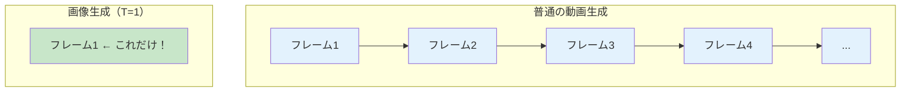

</div>

---
#### 🔬 技術者向け：動画→画像変換の核心メカニズム

**統合入力表現システム**:
HunyuanVideoは入力を`T×C×H×W`テンソル（※4次元数字箱）として扱い、Tがフレーム数を表します。画像生成時は`T=1`として処理されます。

**統合処理の実現**:
Binary Mask（※ON/OFF切替）システムにより、画像と動画を統一的に処理できる設計になっています。

この統合設計により、動画生成の高度な表現力を1フレーム生成にも活用できるのです。

---
#### 💡 「じゃあ、なんでLoRA学習もできるの？」

**ふんわり説明**:
動画用AIでも1フレームで学習できる理由は、結局「フレーム数=1の動画」として学習しているからです。

<div style="width: 100%; overflow-x: auto; margin: 1em 0;">

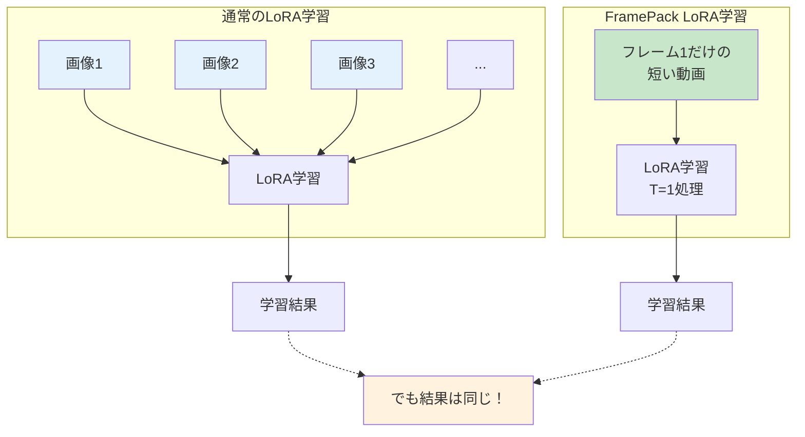

</div>

**技術的な理由**:
- HunyuanVideoの`T=1`処理により、画像学習が可能
- LoRA（※AI調整技術）は元モデルの一部だけを調整するので、動画AIでも適用できる
- フレーム間の関係性を学習する必要がないので、1フレームでも効果的

つまり、「動画AIの1フレーム特化版」として使えるってことですね♪

#### 🤔 「でも、なんでLoRAによって設定値が違うの？」

**ふんわり説明**:
LoRAを学習した人が「この設定で学習したから、推論でも同じ設定を使ってね」って決めているからです。

<div style="width: 100%; overflow-x: auto; margin: 1em 0;">

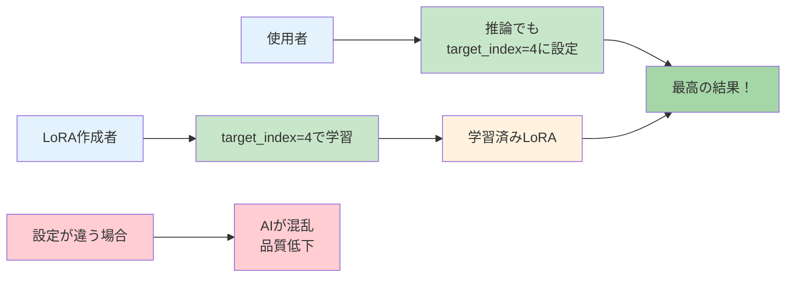

</div>

**技術的な理由**:
学習時と推論時のパラメータが違うと、AIが混乱してしまうんです。

**⚠️ 現在の開発状況**:
実は、FramePack1フレーム推論及び着せ替え用LoRAの作成は現在も有識者の方々が研究・実験を重ねている段階です。最適なパラメータ設定はまだ完全には確立されておらず、コミュニティ全体で知見を共有しながら、より良い手法を模索している状況なんです。

---
#### 🔬 技術者向け：LoRA特化設定値の根拠

**kisekaeichi用LoRA学習設定の一例**:
kisekaeichi（着せ替え）特化のLoRA学習での設定例として、以下のような値が報告されています：
- fp_1f_target_index: 4（従来の1ではなく4が良好とされる）
- fp_1f_clean_indices: [0, 10]（clean Latents範囲指定）
- fp_1f_no_post: true（post処理無効化）
- learning_rate: 1e-3（学習速度設定）
- discrete_flow_shift: 6（学習流れ調整、ドキュメント推奨3.0だが推論時7.0のため調整）

**⚠️ 重要**: これらの設定値はkisekaeichi（着せ替え）用途に特化した一例です。学習内容や目的によって最適な設定は異なりますので、あくまで参考値としてご活用ください。

**設定値指定が必要な理由**:
1. **学習一貫性**: 学習時のフレーム配置と推論時を一致させる必要
2. **最適化特化**: 特定のtarget_index（例：4）での学習に最適化されたLoRA
3. **品質保証**: 異なる設定では学習済みの特徴が正しく発現しない

**経験値の背景**:
- **target_index=1**: 従来推奨だが「あまり良くない」（経験的報告）
- **target_index=4**: 実際の学習で良好とされる値
- **history_index=13**: 長期品質保持で推奨される値

**📋 研究開発の現状**:
これらの設定値は、有識者の方々による継続的な実験と検証に基づくコミュニティの知見です。FramePack技術は比較的新しく、LoRA着せ替え学習の最適化手法はまだ発展途上の段階にあります。

**🔬 最新の技術開発動向**:
2025年6月現在、image embedding source機能（fp_1f_image_embedding_source）の開発が進行中です。この機能により、学習時にimage embeddingをどの段階の画像（開始画像またはclean latent post処理後画像など）から取得するかを選択可能になります。これにより、embedding情報と実際の学習内容の整合性が向上し、より精密なkisekaeichi制御が期待されています。

コミュニティ全体で知見を共有し、より良い手法を模索している状況です。

---
つまり、LoRAには「取扱説明書」が付いていて、作った人が「この設定で使ってね」と指定しているということですね。

### かんわきゅうだい：動画作るのAIは大変だった

#### 前の動画AI
```
長い動画作る = めちゃくちゃメモリ使う
120秒の動画 = もう全然無理！
```

普通のパソコンでは**全く作れなかった**んです。

#### FramePackのすごいところ
```
メモリ使用量 = いつも同じ（長さ関係ない）
120秒の動画でも6GBのグラボで作れる！
```

### どうやって解決したの？：「大事なとこだけしっかり作る」

#### 前のやり方（全部同じ品質）

<div style="width: 100%; overflow-x: auto; margin: 1em 0;">

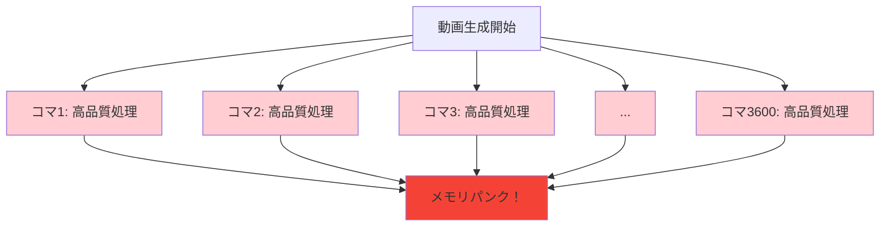

</div>

#### FramePackのやり方（大事なとこだけしっかり）

**FramePackの重要度別処理フロー**

<div style="width: 100%; overflow-x: auto; margin: 1em 0;">

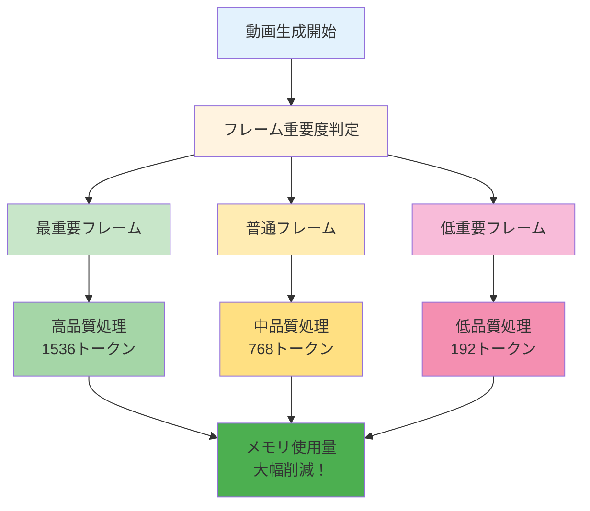

</div>

## その3：じゃあ実際に使ってみようか

### oichi（お壱の方）：着せ替え専用モード

#### 🎭 oichiって何？
**oichi**は**1フレーム推論および着せ替え専用**のFramePackモードです。キャラクターの服だけを変えるのが得意なモードですね。今回は**kisekaeichi**(着せ替え)に焦点を置きますね。

**oichi(kisekaeichi)処理フロー**

<div style="width: 100%; overflow-x: auto; margin: 1em 0;">

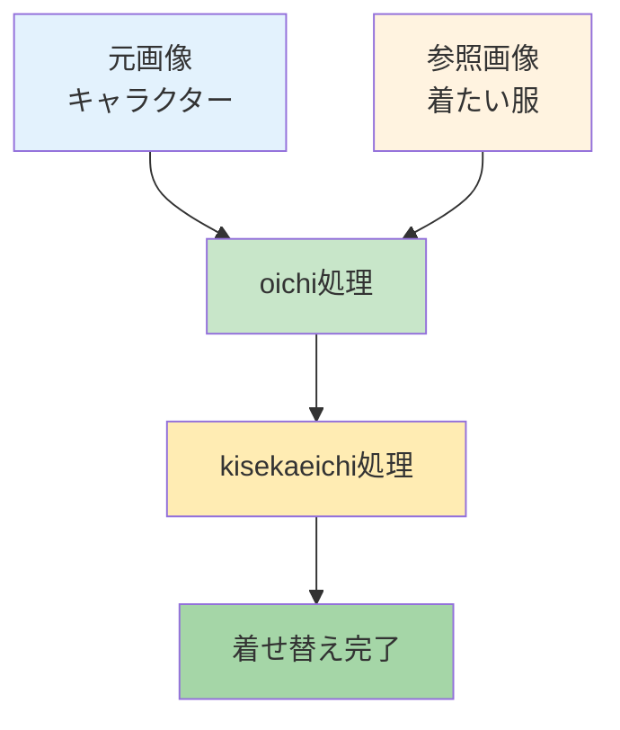

</div>

#### kisekaeichi(着せ替え)の仕組み

**ふんわり説明**:
- **元画像**: 着せ替えしたい子の写真
- **参照画像**: 着せたい服の写真
- **AIがやってくれること**: 「この服をこの子に着せてみるね」

**着せ替え実例**

<div style="width: 100%; overflow-x: auto; margin: 1em 0;">

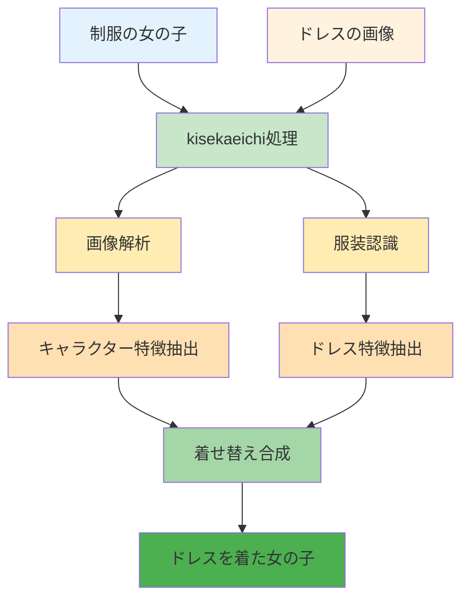

</div>

#### oichiのおすすめ設定

```
target_index: 4      ← ちょうどいい変化量
history_index: 13    ← 記憶力をしっかり保つ
RoPE値: 9           ← デフォルト値（変更不要）
latent_index: 0      ← スタート地点
use_clean_latents_2x: ON  ← お掃除機能その1
use_clean_latents_4x: ON  ← お掃除機能その2
use_clean_latents_post: ON ← 最後の仕上げお掃除
```

**ちょっと詳しい話**:
- **oichiは1フレーム推論専用**なので、動画生成とは根本的に異なる仕組みです
- RoPE値は理論上64まで設定可能ですが、**9で十分**です（変更する必要はほぼありません）
- いろいろな数字をうまく組み合わせて、着せ替えがうまくいくように調整されています

### musubi-tuner版： 1f-mc（One Frame Multi-Condition）手法

#### 🎯 1f-mcって何？

**1f-mc**は**1フレーム・マルチ条件**の略で、複数の画像を同時に使って、より精密な制御ができる新しい手法です！背景も変えられたりしちゃいます！

**従来のkisekaeichi vs 1f-mc**：

<div style="width: 100%; overflow-x: auto; margin: 1em 0;">

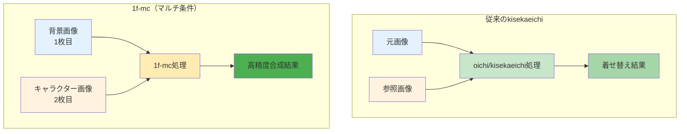

</div>

#### 🔧 1f-mcの仕組み

**ふんわり説明**:
- **1枚目**: 背景をそのまま保持
- **2枚目**: キャラクターの特徴を参照
- **結果**: 背景は変えずに、キャラクターだけを精密に配置

**1f-mc処理フロー**：

<div style="width: 100%; overflow-x: auto; margin: 1em 0;">

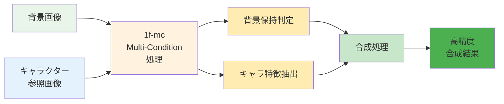

</div>

#### 💡 実際の使い方

**画像の指定方法**：
```
--image_path "背景画像.png,キャラクター画像.jpg"
```

**使用例**：
<div style="width: 100%; overflow-x: auto; margin: 1em 0;">

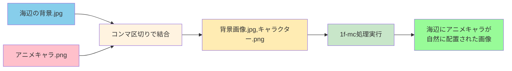

</div>

#### ⚠️ 重要なポイント

**1. 画像の順序を守る**
```
学習時: 背景,キャラクター の順序
推論時: 同じ順序を維持する必要あり
```

**2. データセット形式**
```json
{
  "image_path": "result/image.jpg",
  "control_path": "bg/background.png,char/character.png", 
  "caption": "アニメキャラクターが海辺に立っている"
}
```

**3. 学習時間**
```
通常のLoRA: 500-800ステップ
1f-mc: 約1000ステップ（長めの学習が必要）
```

#### 🎭 1f-mcの応用例

**使用シーン**：
- 固定背景にキャラクターを配置
- 背景の一貫性を保ちながらキャラ変更
- より精密な合成制御が必要な場合

**実践的メリット**：
- 背景の細部まで保持可能
- キャラクターの配置がより自然
- 複数条件の同時制御

**1f-mc実践ワークフロー**：

<div style="width: 100%; overflow-x: auto; margin: 1em 0;">

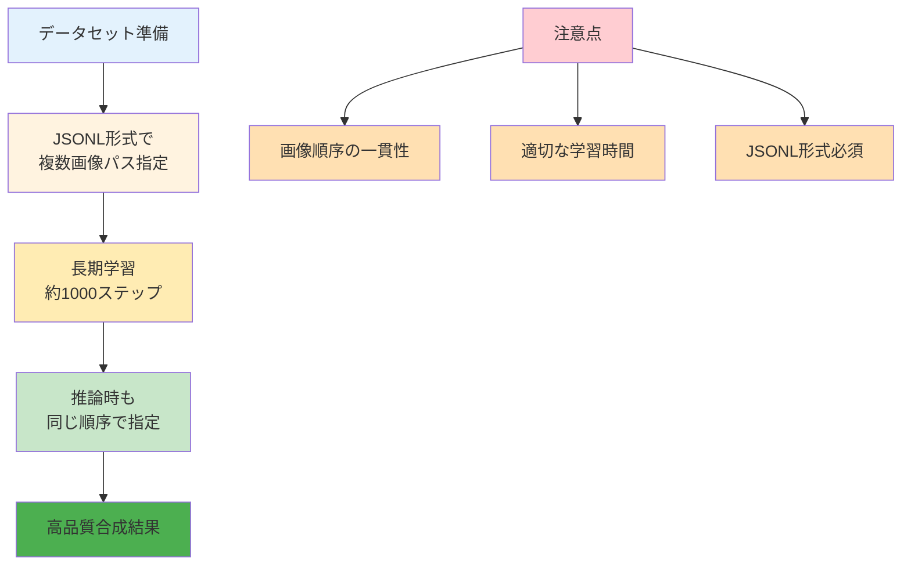

</div>


## まとめ：結局あの謎パラメータたちは何だったの？

### target_index = 変化の度合いダイヤル
「元の絵からどのくらい変えるか」

### history_index = AIの記憶力設定
「どのくらい前のことを覚えておくか」

### RoPE値 (latent_window_size) = 一度に処理する量
「パソコンに優しい量で作業しよう」

### latent_index = 処理のスタート地点
「どこから処理を始めるか」

### clean Latents = お掃除機能
「長い動画でもキレイに保つための機能」

つまり、あの「意味不明なパラメータ」たちは、実は**普通のパソコンで長い動画を作る**というすごいことを実現するための、よく考えられた技術だったんですね。~~なぜか画像を生成することに酷使されてるけど。~~

今度FramePack-oichiを使う時は、これらのパラメータが「すごい技術の結晶」だってことを、なんとなく思い出してくださいね♪

---

## 📚 専門用語集：困った時はここを見てね

### 基本AI技術の用語

#### インデックス（index）って何？
**ふんわり説明**: 順番を表す番号
- 0番目、1番目、2番目...みたいな感じ
- コンピューターは0から数え始めるのが普通
- target_indexなら「何番目のを作るか」という意味

#### フレームって何？
**ふんわり説明**: 動画の1コマ1コマのこと
- パラパラ漫画の1枚1枚がフレーム
- 動画は実はたくさんのフレーム（静止画）の集まり
- 1秒間に30枚とか60枚のフレームがある

#### テンソル（Tensor）って何？
**ふんわり説明**: AIが使う多次元の数字の箱
- 1次元：数字の列 [1, 2, 3, 4]
- 2次元：表みたいな感じ
- 3次元以上：よくわからないけどAIは使いこなしてる
- T×C×H×W = 時間×チャンネル×高さ×幅の4次元箱

#### レイテント（Latent）って何？
**ふんわり説明**: AIが絵を理解する時の「内部の数字」みたいなもの
- 人間には見えない数字の塊
- AIはこの数字で絵を「覚えて」います
- この数字がちょっとずつズレると絵も変わる
- 「潜在空間」とか難しく言われることもあるけど、要は「AIの頭の中」

**例え話**: 
絵 → AIが数字に変換 → 数字をいじる → 新しい絵ができる
みたいな感じです

#### Diffusion（ディフュージョン）って何？
**ふんわり説明**: ノイズから絵を作る技術
- 最初はザラザラノイズ
- だんだんノイズを取り除いて絵にしていく
- 13億パラメータ = めちゃくちゃ賢いバージョン

#### GPUって何？
**ふんわり説明**: 絵を描くのが得意なパソコンの部品
- グラフィックボード、グラボとも呼ばれる
- 普通のCPUより絵の処理がめちゃくちゃ速い
- RTX 3060、RTX 4090みたいな名前がついてる
- 数字が大きいほど高性能（でも高い）

#### VRAMって何？
**ふんわり説明**: GPUが使えるメモリ（記憶容量）
- 6GB、12GB、24GBみたいに表示される
- 大きいほど複雑な作業ができる
- でも大きいグラボは高い...

#### LoRA（ローラ）って何？
**ふんわり説明**: AIを少しだけ調整する技術
- Low-Rank Adaptationの略らしい
- 元のAIは変えずに、追加部品で性能を調整
- 「この絵柄で描いて」「この人の顔で描いて」みたいな指示ができる
- ファイルサイズが小さくて便利

### HunyuanVideo技術の用語

#### アテンション（Attention）って何？
**ふんわり説明**: AIが「どこを見ればいいか」を決める仕組み
- 人間が写真を見る時、重要な部分に自然と目がいくのと同じ
- AIも「この部分が大事」「この部分は無視していい」を判断する
- 要は「注目ポイント決定システム」

#### 時空間アテンション vs Full Attention って何が違うの？

**従来の時空間アテンション**:
「時間」と「空間」を別々に見る方式
```
時間方向: フレーム1 → フレーム2 → フレーム3 を別々にチェック
空間方向: 画面の上下左右を別々にチェック
→ バラバラに処理するので見落としがある
```
**HunyuanVideoのFull Attention**:
「時間も空間も一緒に」見る方式
```
全部まとめて: フレーム全体 + 画面全体を一度に見る
→ 関係性を見逃さない、性能も良い
```
**例え話**:
- **時空間アテンション**: 右目で時間、左目で空間を別々に見る
- **Full Attention**: 両目でしっかり全体を見る

だから Full Attention の方が賢くて高性能なんですね

#### Dual-stream → Single-stream って何？
**ふんわり説明**: 2つの川が1つの川に合流するイメージ

<div style="width: 100%; overflow-x: auto; margin: 1em 0;">

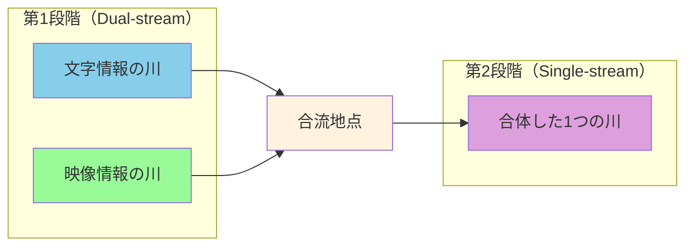

</div>

**なぜこうするの？**:
- 最初は文字と映像を別々に処理（混乱防止）
- 後で合体させて複雑な関係性を理解
- 効率よく賢い処理ができる

#### VAE（ブイエーイー）って何？
**ふんわり説明**: 絵を数字に変換したり戻したりする装置
- Variational AutoEncoderの略らしい
- 絵→数字→絵の変換を担当
- Causal 3D VAEは「原因と結果を考慮した3次元版」
- 要は絵の圧縮・展開を賢くやってくれる

#### RoPE 3D（ロープ3D）って何？
**ふんわり説明**: AIが「どこにいるか」を覚える仕組みの3D版
- RoPE = **R**otary **P**osition **E**mbedding（回転位置エンコーディング）の略
- 従来方式は「位置を足し算」だったが、RoPEは「位置で回転」する革新的手法
- 普通のRoPEは平面（2D）の位置を覚える
- RoPE 3Dは立体（3D）+ 時間も覚える
- つまり「いつ・どこの・どの位置」を全部記録

**技術的な仕組み**:
- 位置に応じて回転角度θを変える（θは位置に比例）
- 相対位置関係を正確に保持
- ベクトルの角度と内積が一定になる数学的特性

**例え話**: 
- 普通のRoPE: 地図上の位置（X座標、Y座標）
- RoPE 3D: 地図 + 高さ + 時間（X、Y、Z、時刻）

#### Binary Mask（バイナリマスク）って何？
**ふんわり説明**: 0と1で「使う/使わない」を決める仕組み
- [1, 0, 0, 0, ...] = 最初だけ使う、後は使わない
- 画像生成時にT=1フレームのみ有効にする時に使用
- 要は「ONとOFFの切り替えスイッチ」

#### Causal制約（コーザル制約）って何？
**ふんわり説明**: 「未来のことは参考にしちゃダメ」という制限
- target_index ≤ history_index でないとダメ
- causal = 原因と結果の順序を守る
- 時間の流れに沿った処理を保証

### FramePack技術の用語

#### Anti-drifting（アンチドリフティング）って何？
**ふんわり説明**: 長い動画で画質が悪くなるのを防ぐ技術
- drifting = だんだんズレて品質が悪くなること
- Anti = それを防ぐ
- 双方向サンプリングで品質を保つらしい

#### effective_window_size（エフェクティブ・ウィンドウサイズ）って何？
**ふんわり説明**: 実際に使われるウィンドウの大きさ
- latent_window_sizeが「最大サイズ」、effective_window_sizeが「実際のサイズ」
- 実際の生成フレーム数を決める重要な数字
- effective_window_size=9なら33フレーム、10なら37フレームになる

### 学習・設定関連の用語

#### epochs（エポック）って何？
**ふんわり説明**: 学習データを何回繰り返すかの回数
- 1 epoch = 学習データ全部を1回見る
- 30 epochs = 同じデータを30回繰り返し学習
- 多すぎると覚えすぎて応用が利かなくなる

#### learning_rate（学習率）って何？
**ふんわり説明**: AIがどのくらいの速さで学習するかの設定
- 大きすぎる：焦りすぎて失敗する
- 小さすぎる：のんびりすぎて時間がかかる
- 1e-3 = 0.001 = ちょうどいい速さらしい

#### discrete_flow_shift（ディスクリート・フロー・シフト）って何？
**ふんわり説明**: 学習の流れを調整するパラメータ
- 詳細な動作原理は実装に依存

#### fp_1f_clean_indices（FP 1フレーム クリーンインデックス）って何？
**ふんわり説明**: 1フレーム学習でのclean Latents範囲指定
- [0, 10] = 0番目から10番目までをお掃除対象に
- fp = FramePackの略
- 1f = 1フレームの略

#### fp_1f_no_post（FP 1フレーム ノーポスト）って何？
**ふんわり説明**: 1フレーム学習でpost処理を無効にする設定
- true = post処理をしない
- false = post処理をする
- post処理の具体的内容は実装詳細に依存

---

## 🔗 参考リンク集

### 公式ドキュメント・実装
- **[FramePack GitHub](https://github.com/lllyasviel/FramePack)**: 開発版リポジトリ
- **[FramePack公式サイト](https://lllyasviel.github.io/frame_pack_gitpage/)**: オリジナル実装とドキュメント
- **[HunyuanVideo論文](https://arxiv.org/html/2412.03603v1)**: 基盤技術の学術論文

### 拡張実装・ツール
- **[musubi-tuner](https://github.com/kohya-ss/musubi-tuner)**: 学習機能拡張版
- **[ComfyUI-FramePackWrapper_PlusOne](https://github.com/tori29umai0123/ComfyUI-FramePackWrapper_PlusOne)**: ComfyUI統合版
- **[mattyamonaca氏のスクラップ](https://zenn.dev/mattyamonaca/scraps/52cec92dc49cfe)**: 実装詳細と技術解説

### 技術解説・実証データ
- **Kohya Tech氏**: X(Twitter)での実証実験と最適化データ
- **エマノン氏**: X(Twitter)での検証結果とパラメータ調整
- **Musubi Tuner PR #306, #331**: 実装詳細とコード解析

### コミュニティ・サポート
- **GitHub Issues**: 技術的な質問とトラブルシューティング

このガイドが、あの謎めいたパラメータたちとの「なんとなく理解」の架け橋になれば幸いです♪