# FramePack-oichiなんとなく理解ガイド：あの謎パラメータたちとゆる～く仲良くなろう

## はじめに：なんか色々設定あるけど...よくわからないよね？

FramePack-oichiを使おうとすると、なんか色々な設定があるよね...

**そもそもの問題**: **oichi実装時の表記ゆれが原因でMusubi Tunerと用語が違う**ので余計に混乱しちゃう！
（※Musubi Tunerは正しくFramePack標準用語を使用しており、問題はoichi側の実装にあります）

- **ターゲットインデックス**と**レイテントインデックス**って違うの？ 同じもの？ → 【解決】**同じ機能です！ターゲットインデックスが優先されます**
- **履歴インデックス** (history_index)って何の履歴？ 検索履歴？**clean index**というキーワードもあるけど？ → 【解決】**clean index**の方が標準用語で**参照フレーム位置のことです**
- UIの「**RoPE値** (latent_window_size)」って何のサイズ？ ブラウザの窓？ → 【解決】**フレーム処理範囲の設定です。厳密にはRoPE値 ＝latent_window_sizeではありません**
- じゃあ**RoPE値**(rope_scaling)って何をするの？ → 【解決】**位置エンコーディングの精度調整です**
- **clean latents**って掃除？ 何がキレイになるの？ → 【解決】**参照画像システムです！お掃除機能ではありません**

まあ、細かいことはよくわからないけど、とりあえず**1フレーム推論と着せ替えができればいいよね**という感じで、ゆる～く理解していきましょう♪

## 📚 技術的根拠と出典

このガイドは以下の先駆者様の情報を参考にしています：
- **Kohya氏の記事**: "[FramePackの推論と1フレーム推論、kisekaeichi、1f-mcを何となく理解する](https://note.com/kohya_ss/n/nbd94d074ddef)" (2025年6月7日)
- **furusu氏**: kisekaeichi手法の提案者様
- **mattyamonaca氏**: 1f-mc手法の提案者様

**⚠️ 重要な更新情報**: Kohya氏の記事公開により、本ガイドの技術的記述を一部修正しました。各項目の抜本的な見直しを実施しています。

## その1：なんか色々あるパラメータたち

### 🚨 重要：重複UI問題について

現在oichiには**同じ機能のパラメータが2つの名前で表示される問題**があります：
- **ターゲットインデックス**（kisekae詳細設定エリア：デフォルト1、範囲0-8）
- **レイテントインデックス**（一般設定エリア：デフォルト0、範囲0-64）

**実際の動作**: ターゲットインデックスが優先され、レイテントインデックスを上書きします（コードにて確認済み）。これは将来的に統一されることが期待されるパラメータです。

**⚠️ ユーザーへの推奨**: 現在は**ターゲットインデックスのみを調整**してください。レイテントインデックスは無視されます。

### 📍 生成フレーム系パラメータ

#### ターゲットインデックス（target_index）＝latent_index（生成フレーム位置指定）
##### 🤔 「この数字何？変えたら何か起こるの？」

**ふんわり説明**:
動画のどのフレーム目を生成するかを決める数字です。小さいとあんまり変わらないし、大きいと結構変わります。

**🎯 1フレーム推論での特別な意味**:
1フレーム推論では、target_index（=latent_index）は潜在空間（AI内部の数字世界）での「位置指定」として機能するんだ。動画推論とは根本的に異なり、単一画像の品質制御に特化した役割を果たしているよ。

**🎯 Kohya氏の記事による正確な定義**:
Kohya氏の解説によると、target_index（=latent_index）は「生成するフレームのindex」を指定します。FramePack-oichiでは`latent_indices`に設定され、**Kohya氏の記事の図解でlatent_indices=5**の実例があります。これは当ガイドの推奨値4-6と一致していますね。

**🚨 oichiでの重複UI問題**:
- **ターゲットインデックス**: kisekae詳細設定にある（デフォルト1、範囲0-8）
- **レイテントインデックス**: 一般設定にある（デフォルト0、範囲0-64）
- **実際の動作**: ターゲットインデックスが優先される（内部実装で上書き）

**フレーム進行と target_index（=latent_index） の関係**:

<div style="width: 100%; overflow-x: auto; margin: 1em 0;">

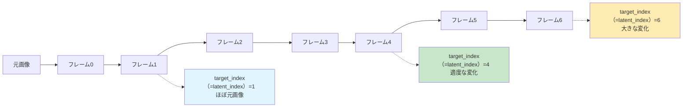

</div>

**ちょっと詳しい話**:
何やら難しい仕組みがあるらしいけど、要するに「変化の度合い調整ダイヤル」みたいなものですね。

#### 💡 「で、結局何にすればいいの？」

「各indexと後述のclean latentsに何を渡すか」を意識し、適当に操作して望みの結果を得る、というシンプルな考え方がいいらしいよ。

**⚠️ 現在のoichiのUIでの注意**: 今のUIでは**ターゲットインデックス**を調整してください（将来的にはこの重複UI問題を修正する必要がありますが、現状はターゲットインデックスが有効です）。

**なんとなくの目安**:
- **ターゲットインデックス=1**: ほとんど変わらない（ちょっと物足りない）
- **ターゲットインデックス=4-6**: いい感じに変わる（これがおすすめ♪）
- **ターゲットインデックス=8**: 変わりすぎて別人になっちゃうかも

**⚠️ 重要**: latent_index=4-6という推奨値は一般的に使用されている経験則ですが、**LoRA使用時はLoRAの推奨設定を優先**してください。LoRA作成者が指定した値に従い、その上で微調整することで最適な結果が得られます。

#### latent_indices（生成フレーム範囲指定）
- **latent_indices**: 「生成用」- AIが新しく作る画像の範囲指定

**oichiでの扱い**: latent_indices ✅（内部実装、ユーザー操作不要）

---

### 🎯 参照フレーム系パラメータ

#### 履歴インデックス (history_index)＝clean index（参照フレーム位置指定）
##### 🤔 「参照フレームって何？」

**⚠️ 用語統一**: Kohya氏による標準用語は「clean index」です。oichiでは内部実装で「history_index」を使用し、UIでは「履歴インデックス」と表示していますが、FramePack公式実装では「clean index」が採用されており、統一が推奨されています。

**ふんわり説明**:
AIが画像生成時に参考にする画像の位置を決める設定です。「どの位置の参照画像を使うか」を指定する感じ。

<div style="width: 100%; overflow-x: auto; margin: 1em 0;">

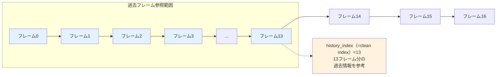

</div>

**ちょっと詳しい話**:
何やら複雑な仕組みで品質を保つための設定だそうです。まあ、よくわからないけど大事らしい。

#### 💡 「結局何にすればいいの？」

**なんとなくの答え**:
コミュニティで「13がいいよ～」と推奨されているので、13近辺で微調整してみましょう♪

**微調整について**:
ターゲットインデックス(taerget_index＝latent_index)のように、履歴インデックス(history_index＝clean_index)も用途に応じて微調整することができます：
- **軽めの変化**: 8-12（よりシンプルな出力変化）
- **基本設定**: 13（コミュニティ推奨値）
- **より安定した出力**: 15-20（出力の一貫性を重視）

**⚠️ 重要**: LoRA使用時はLoRAの推奨設定値を最優先してください。作成者が指定した設定に従うことで最高の結果が得られます。

#### clean_indices（参照フレーム範囲指定）
##### 💭 「内部処理用パラメータ - ユーザーは意識不要」

- **clean_latent_indices**: 「参考にする画像」の範囲

**【確認】latent_indicesとの違い**:

**ふんわり説明**:
AIが参考にする画像の範囲を内部的に指定します。clean_indexが「どの位置」なら、clean_indicesは「どの範囲」を指定する感じです。**1フレーム推論では自動設定されるため、ユーザーが直接操作する必要はありません**。

**oichiでの扱い**: clean_latent_indices ✅（内部実装、ユーザー操作不要）

---

### ⚙️ システム設定系パラメータ

#### latent_window_size (RoPE値)（フレーム数制限）
##### 🤔 "フレーム数制限って何？"

**ふんわり説明**:
AIが一度にどのくらいの量のフレーム（動画のコマ）を処理するかの設定です。窓から外を見る時の窓の大きさみたいなもので、大きい窓なら一度にたくさん見えるけど、小さい窓なら少しずつしか見えない感じ。

**💡 RoPEって何？**: 
RoPE = **Ro**tary **P**osition **E**mbedding（回転位置エンコーディング）の略です。AIが「どこの位置の情報か」を覚えるための技術の名前だそうです。

昔のAIは「順番」を覚えるのがちょっと苦手だったんです。でもRoPEは「くるくる回転」という面白い方法で、「これは何番目にあるのか」を上手に覚えられるようになったそうです。

**🔬 Kohya氏による重要な技術的洞察**:
FramePackのモデルは、Inverted anti-driftingの適用などにより、**RoPEの値（clean latent indicesやlatent indicesの値）への感受性が高い**とのことです。これが1フレーム推論やkisekaeichiが機能する技術的根拠となっています。

**🔬 重要な技術的関係**: latent_window_sizeは、実際のインデックス配列（latent_indices, clean_latent_indices等）の生成範囲を決定する基盤パラメータです。コード実装では、latent_window_sizeを使って「1:1+latent_window_size」の範囲でlatent_indicesが生成されており、これがKohya氏の言う「RoPEの値への感受性」の技術的根拠となっています。

**ウィンドウ処理の仕組み**:

<div style="width: 100%; overflow-x: auto; margin: 1em 0;">

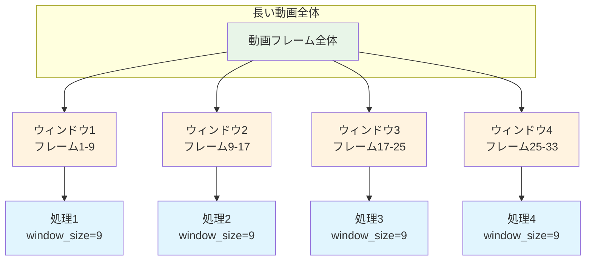

</div>

**ちょっと詳しい話**:
メモリを効率よく使うための工夫だそうです。9がちょうどいいバランスらしい。

#### 💡 「で、何にすればいいの？」

**なんとなくの答え**:
- **小さすぎる**: なんか変になる
- **大きすぎる**: パソコンが重くなる
- **9**: ちょうどいい（みんなこれ使ってる）


#### rope_scaling（RoPE値スケーリング）
##### 💭 "rope_scalingって何を拡大縮小するの？"

**【解決】簡単な説明**:
「位置エンコーディングの精度調整」です。AIが「どこにいるか」を理解する精度を細かく調整する設定です。

**ふんわり説明**:
AIが位置を認識する精度を調整する設定です。通常はデフォルト値のままで大丈夫です。RoPEの仕組みをより細かく調整したい上級者向けの設定ですね。

**実用的な結論**: ほとんどの場合、触る必要はありません。

**oichiでの扱い**: rope_scaling ✅（FramePack標準と同じ）

---

### 🖼️ 参照画像系パラメータ

#### clean_latents（参照画像配列）
##### 🤔 「clean Latentsって掃除？何がキレイになるの？」

**【解決】正確な説明**:
Kohya氏の解説による正式な定義では、clean latentsは「モデルが動画生成時に参考にする画像の配列」です。

**⚠️ よくある誤解を解決**: 「clean = お掃除機能」ではありません！「clean = きれいな参照画像」という意味です。正確には「参照画像システム」として機能します。

**ふんわり説明**: AIが「この画像を参考にして作って」と指示を受け取る仕組みです。

**Kohya氏の記事図解との対応**:

<div style="width: 100%; overflow-x: auto; margin: 1em 0;">

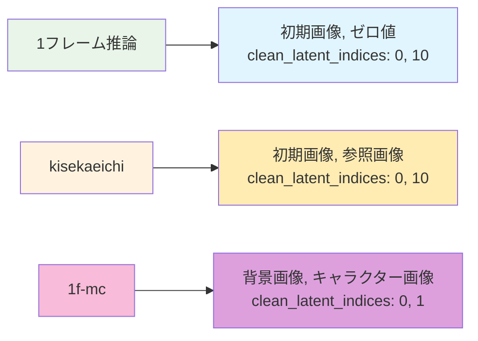

</div>

**🔧 Kohya氏の記事による具体的構成**:
- **1フレーム推論**: `clean latents=[初期画像, ゼロ値]` + `clean_latent_indices=[0, 10]`
- **kisekaeichi**: `clean latents=[初期画像, 参照画像]` + `clean_latent_indices=[0, 10]`
- **1f-mc**: `clean latents=[背景画像, キャラクター画像]` + `clean_latent_indices=[0, 1]` ← 特殊な値

つまり、clean latentsは「AIが参考にする画像の組み合わせ」で、履歴インデックス (history_index（=clean index）) がその位置を指定しているということですね。

**参照画像処理の流れ**:

<div style="width: 100%; overflow-x: auto; margin: 1em 0;">

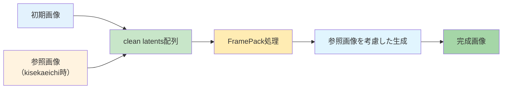

</div>

**ちょっと詳しい話**:
FramePackは参照画像を使って「こんな感じの画像を作って」という指示を出すシステムです。clean latentsの2x、4xは縮小版の参照画像で、メモリを節約しながら多くの情報を参照できる工夫です。

#### 💡 「2x、4x、postって何？」

**縮小版参照画像の種類**:
- **2x**: 中解像度での参照画像（768トークン相当、縦横1/2縮小）
- **4x**: 高解像度での参照画像（384トークン相当、縦横1/4縮小）  
- **post**: 最終段階での品質調整とノイズ除去

**🎯 メモリ効率化の工夫**:
Kohya氏の記事によると、clean latents 2x, 4xは「小さく縮小して渡すことでメモリ使用量を増やすことなく多数の画像を参照できる」という仕組みです。ただし実際の効果については「あまり効いてない」との記述もあります。

**⚠️ LoRA使用時の最重要注意**:
clean Latentsの設定（2x、4x、post）は**LoRAによって大きく異なります**！
- **全有効推奨のLoRA**: 2x/4x/post全てON
- **全無効推奨のLoRA**: 2x/4x/post全てOFF（例：CH4NG3CH4R.safetensors）

必ず使用するLoRAの推奨設定に従ってください。

---

### 🔗 参考情報：関連プロジェクトと実装バリエーション

#### 実装プロジェクト一覧
現在、FramePackの1フレーム推論および着せ替えは複数のプロジェクトで実装・拡張されています：

**主要実装**：
- **[musubi-tuner](https://github.com/kohya-ss/musubi-tuner)**: 学習機能拡張版
- **[ComfyUI-FramePackWrapper_PlusOne](https://github.com/tori29umai0123/ComfyUI-FramePackWrapper_PlusOne)**: ComfyUI統合版
- どこかの叡智なやつ

#### 実装による特徴の違い
各実装には特色があり、用途に応じて選択できます：

**musubi-tuner版の特徴**：
- 単一フレーム学習とLoRA統合
- kisekaeichi（着せ替え）手法の実装
- 1f-mc手法の実装

**ComfyUI版の特徴**：
- F1サンプラーによる時間的一貫性向上
- タイムスタンプ・プロンプト機能
- 複数LoRAの組み合わせ（強度0.0-2.0）

これらの発展により、FramePackは動画生成から画像編集まで幅広い用途に対応する技術として成長を続けています。

## 🔧 実装間の用語対応表

**重要**: FramePackの各実装では同じ概念に対して異なる用語が使用されています。以下の対応表を参考にしてください：

| 概念 | FramePack標準 | oichi実装 | Musubi Tuner | 説明 |
|------|---------------|-----------|--------------|-----------------|
| 生成フレーム位置 | latent_index | ⚠️ 重複UI: レイテントインデックス・**ターゲットインデックス（こちらが有効）** | latent_index | 何フレーム目を生成するか |
| 生成フレーム範囲 | latent_indices | ✅ latent_indices  ※内部項目| latent_indices | 複数フレーム生成の範囲 |
| 参照フレーム位置 | clean_index | ❌ 履歴インデックス（history_index・非推奨用語） | clean_index | 参考にするフレームの位置 |
| 参照フレーム範囲 | clean_indices | ✅ clean_latent_indices ※内部項目| clean_indices | 参照フレームの範囲 |
| フレーム数制限 | latent_window_size | ✅ RoPE値(latent_window_size) ※UI表記 | latent_window_size | 一度に処理するフレーム数 |
| 参照画像配列 | clean_latents | ✅ clean_latents| clean_latents | モデルが参考にする画像群 |

**💡 より良いユーザー体験に向けて** (2025年6月8日更新): 
1. **標準用語の採用**: Kohya氏による標準用語への統一が進んでいます
2. **実装の標準化**: Musubi Tuner、FramePack公式は既に標準用語を採用済み
3. **UI改善の方向性**: ターゲットインデックス・レイテントインデックスの統合により利便性向上が期待されます
4. **ユーザビリティ向上**: より分かりやすい用語統一により、学習効果の向上が期待されます

---
## その2：なんでこんなに複雑なの？

### 💡 動画AIで1枚の絵が作れる理由

**シンプルな説明**: 
HunyuanVideoは「**画像 = 長さ1フレームの動画**」として処理します。つまり、動画生成の技術をそのまま1枚の画像生成に使えるのです。

#### 🤔 「でも、なんでLoRAによって設定値が違うの？」

**ふんわり説明**:
LoRAを学習した人が「この設定で学習したから、推論でも同じ設定を使ってね」って決めているからです。

<div style="width: 100%; overflow-x: auto; margin: 1em 0;">

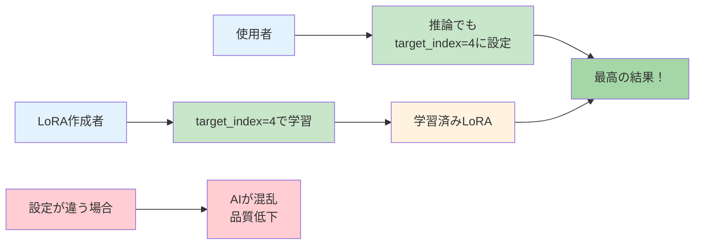

</div>

**技術的な理由**:
学習時と推論時のパラメータが違うと、AIが混乱してしまうんです。

**⚠️ 現在の開発状況**:
実は、FramePack1フレーム推論及び着せ替え用LoRAの作成は現在も有識者の方々が研究・実験を重ねている段階です。最適なパラメータ設定はまだ完全には確立されておらず、コミュニティ全体で知見を共有しながら、より良い手法を模索している状況なんです。

---
#### 🔬 技術者向け：LoRA特化設定値の根拠

**kisekaeichi用LoRA学習設定の一例**:
kisekaeichi（着せ替え）特化のLoRA学習での設定例として、以下のような値が報告されています：
- fp_1f_target_index: 4（従来の1ではなく4が良好とされる）
- fp_1f_clean_indices: [0, 10]（clean Latents範囲指定）
- fp_1f_no_post: true（post処理無効化）
- learning_rate: 1e-3（学習速度設定）
- discrete_flow_shift: 6（学習流れ調整、ドキュメント推奨3.0だが推論時7.0のため調整）

**⚠️ 重要**: これらの設定値はkisekaeichi（着せ替え）用途に特化した一例です。学習内容や目的によって最適な設定は異なりますので、あくまで参考値としてご活用ください。

**設定値指定が必要な理由**:
1. **学習一貫性**: 学習時のフレーム配置と推論時を一致させる必要
2. **最適化特化**: 特定のtarget_index（例：4）での学習に最適化されたLoRA
3. **品質保証**: 異なる設定では学習済みの特徴が正しく発現しない

**経験値の背景**:
- **target_index=1**: 従来推奨だが「あまり良くない」（経験的報告）
- **target_index=4**: 実際の学習で良好とされる値
- **履歴インデックス (history_index＝clean_index)=13**: 長期品質保持で推奨される値

**📋 研究開発の現状**:
これらの設定値は、有識者の方々による継続的な実験と検証に基づくコミュニティの知見です。FramePack技術は比較的新しく、LoRA着せ替え学習の最適化手法はまだ発展途上の段階にあります。

**🔬 最新の技術開発動向**:
2025年6月現在、image embedding source機能（fp_1f_image_embedding_source）の開発が進行中です。この機能により、学習時にimage embeddingをどの段階の画像（開始画像またはclean latent post処理後画像など）から取得するかを選択可能になります。これにより、embedding情報と実際の学習内容の整合性が向上し、より精密なkisekaeichi制御が期待されています。

コミュニティ全体で知見を共有し、より良い手法を模索している状況です。

---

## その4：実際のLoRAサンプル - 使ってみよう編

### 🎭 LoRAって結局何？どこで手に入るの？

**LoRAサンプル集**:

#### 📁 **1. kisekaeichi専用LoRA（着せ替え特化）**

**配布場所**: [kohya-ss/misc-models](https://huggingface.co/kohya-ss/misc-models)

**おすすめモデル**:
- **fp-1f-kisekae-1024-v4-2.safetensors**: 着せ替え実験版
  - **推奨設定**: target_index=5, 解像度1024x1024
  - **プロンプト例**: "The girl stays in the same pose, but her outfit changes"
  - **用途**: 服装だけを変更、ポーズ・背景維持

- **fp-1f-chibi-1024.safetensors**: アニメキャラ変換版
  - **推奨設定**: target_index=9, 解像度1024x1024
  - **プロンプト例**: "An anime character transforms: her head grows larger, body becomes shorter"
  - **注意**: 効果が強すぎる場合は強度を0.8以下に調整

#### 📁 **2. CH4NG3CH4R.safetensors（着せ替えLoRA）**

**配布場所**: [MEGA Download Link](https://mega.nz/file/6Z1UwJKD#Q8a7YjkPXNIhXSUFNRiXOC1PEYNOi5L2VoFPB3YNRSA)

**実証済み設定例**:
```yaml
通常設定:
  Image: 服を着せたい人物の画像（全裸推奨）
  解像度: 640
  プロンプト: "The character's clothes change to a different outfit. Their pose and the background remain the same."

Kisekaeichi設定:
  参照画像: 服の画像
  入力画像マスクと参照画像マスク: 不要（空のままでOK）
  ターゲットインデックス: 4
  履歴インデックス (history_index＝clean_index): 10

詳細設定（重要！）:
  clean_latents_2xを使用: オフ
  clean_latents_4xを使用: オフ
  clean_latents_postを使用: オフ

LoRA設定:
  LoRA1: CH4NG3CH4R.safetensors
  LoRA適用強度: 1.0
```

**🎯 重要ポイント**: このLoRAではclean_latents機能を**すべてオフ**にするのが推奨設定です！

#### 📁 **3. tori29umai氏提供のLoRA各種**

**配布場所**: [tori29umai/FramePack_LoRA](https://huggingface.co/tori29umai/FramePack_LoRA) (HuggingFace)

**利用可能なLoRAモデル**:
- **photo2line_V2_dim4.safetensors**: 写真を線画に変換
- **photo2chara_V6/V9**: 実写人物をアニメキャラ風に変換
- **Apose_V8_dim4.safetensors**: 様々なポーズをA-pose（立ち姿）に変換
- **カメラ回転系**: 時計回り、反時計回り、ローアングル、ハイアングル変換
- **body2img_V7_kisekaeichi_dim4**: ポーズ・表情参照画像からキャラデザイン生成

**関連アプリ・環境**:
- **「Framepack_imgGEN」**: 1フレーム推論専用アプリ
- **ComfyUI対応**: カスタムノード提供
- **推奨環境**: CUDA対応GPU 12GB以上、メモリ32GB以上

**学習環境**:
- **Musubi Tuner**: FramePack専用ブランチ対応
- **Vast.AI**: クラウド学習環境での利用可能
- **詳細記事**: [Musubi TunerでFramePackのLoRA学習](https://note.com/tori29umai/n/n0be15a6f1832)

### 💡 LoRA使用時の重要な教訓

#### 🚨 **設定値の違いに注意！**

**パターン1: clean_latents全有効** (基本設定)
```
use_clean_latents_2x: オン
use_clean_latents_4x: オン
use_clean_latents_post: オン
```

**パターン2: clean_latents全無効** (CH4NG3CH4R.safetensors等)
```
use_clean_latents_2x: オフ
use_clean_latents_4x: オフ
use_clean_latents_post: オフ
```

**🎯 使い分けの原則**:
- **LoRAの推奨設定を最優先**に従う
- **学習時と推論時の設定一致**が重要
- **実験的LoRA**では特殊設定が必要な場合が多い

#### 📋 **LoRA選択の指針**

**用途別選択**:
- **着せ替え重視**: fp-1f-kisekae系、CH4NG3CH4R
- **キャラ変換**: fp-1f-chibi系
- **ComfyUI環境**: tori29umai氏提供LoRA

**設定調整の基本**:
1. LoRA配布元の推奨設定を確認
2. latent_index、履歴インデックス (history_index＝clean_index)を指定値に設定
3. clean_latents設定を推奨通りに設定
4. テスト生成で効果を確認
5. 必要に応じて強度調整（0.8-1.2範囲）

**⚠️ 現在の開発状況**:
FramePack用LoRAは現在も有識者の方々が研究・実験を重ねている段階です。最適な設定はまだ確立途中ですので、コミュニティでの情報共有と実験が重要です。

---
つまり、LoRAには「取扱説明書」が付いていて、作った人が「この設定で使ってね」と指定しているということですね。

### 🚀 FramePackの技術革新

**従来の問題**: 長い動画を作ろうとするとメモリが足りなくて作れませんでした。

**FramePackの解決法**: 「重要なフレームは高品質、そうでないフレームは低品質」で処理することで、メモリ使用量を大幅削減。120秒の動画も6GBのグラボで作れるようになりました。

## その3：じゃあ実際に使ってみようか

### oichi（お壱の方）：着せ替え専用モード

#### 🎭 oichiって何？
**oichi**は**1フレーム推論および着せ替え専用**のFramePackモードです。キャラクターの服だけを変えるのが得意なモードですね。今回は**kisekaeichi**(着せ替え)に焦点を置きますね。

**oichi(kisekaeichi)処理フロー**

<div style="width: 100%; overflow-x: auto; margin: 1em 0;">

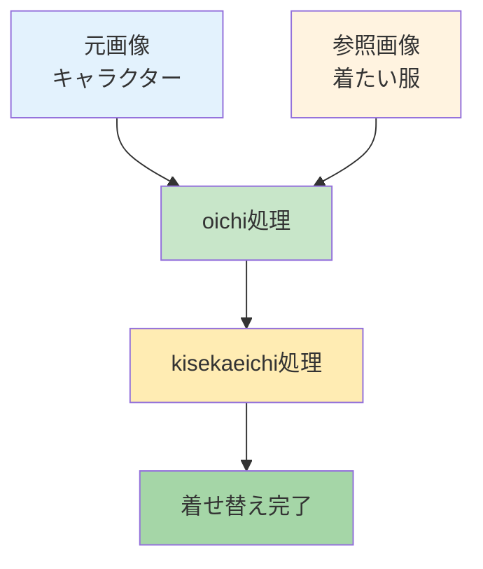

</div>

#### kisekaeichi(着せ替え)の仕組み

**ふんわり説明**:
- **元画像**: 着せ替えしたい子の写真
- **参照画像**: 着せたい服の写真
- **AIがやってくれること**: 「この服をこの子に着せてみるね」

**着せ替え実例**

<div style="width: 100%; overflow-x: auto; margin: 1em 0;">

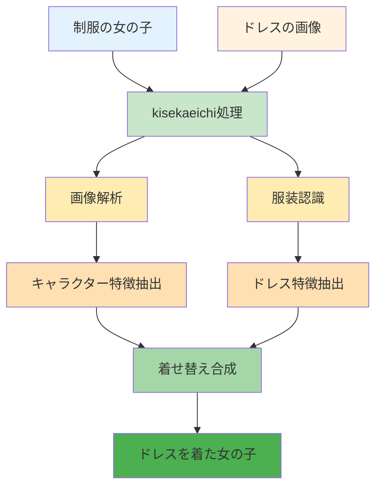

</div>

#### 🎯 oichi基本設定ガイド

**⚠️ 最重要**: LoRA使用時は**LoRAの推奨設定を絶対最優先**してください。以下は一般的な目安値です。

```yaml
基本設定:
  ターゲットインデックス (target_index＝latent_index): 4-6  # 適度な変化量
  履歴インデックス (history_index＝clean_index): 13     # 品質と効率のバランス
  RoPE値 (latent_window_size): 9         # デフォルト推奨
  
参照画像システム (clean_latents):
  2x/4x/post: LoRAの指示に従う  # 全ONまたは全OFF
```

**重複UI問題の対応**:
- **kisekae使用時**: ターゲットインデックスを調整
- **一般使用時**: レイテントインデックスを調整
- **両方設定時**: ターゲットインデックスが優先されます

### 🔬 musubi-tuner: 1f-mc（高精度合成手法）

**1f-mcの特徴**: 複数画像を同時使用し、背景とキャラクターを精密に制御できる新手法です。

**従来のkisekaeichi vs 1f-mc**：

<div style="width: 100%; overflow-x: auto; margin: 1em 0;">

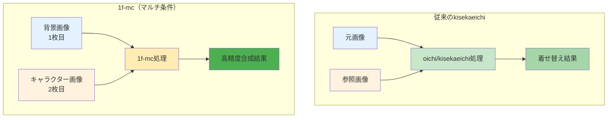

</div>

#### 🔧 1f-mcの仕組み

**ふんわり説明**:
- **1枚目**: 背景をそのまま保持
- **2枚目**: キャラクターの特徴を参照
- **結果**: 背景は変えずに、キャラクターだけを精密に配置

**1f-mc処理フロー**：

<div style="width: 100%; overflow-x: auto; margin: 1em 0;">

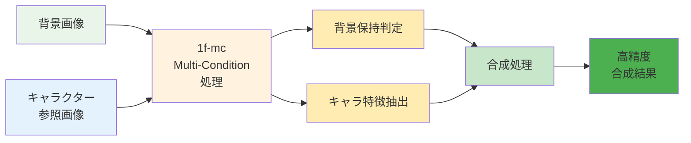

</div>

#### 💡 実際の使い方

**画像の指定方法**：
```
--image_path "背景画像.png,キャラクター画像.jpg"
```

**使用例**：
<div style="width: 100%; overflow-x: auto; margin: 1em 0;">

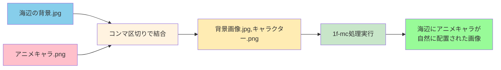

</div>

#### ⚠️ 重要なポイント

**1. 画像の順序を守る**
```
学習時: 背景,キャラクター の順序
推論時: 同じ順序を維持する必要あり
```

**2. データセット形式**
```json
{
  "image_path": "result/image.jpg",
  "control_path": "bg/background.png,char/character.png", 
  "caption": "アニメキャラクターが海辺に立っている"
}
```

**3. 学習時間**
```
通常のLoRA: 500-800ステップ
1f-mc: 約1000ステップ（長めの学習が必要）
```

#### 🎭 1f-mcの応用例

**使用シーン**：
- 固定背景にキャラクターを配置
- 背景の一貫性を保ちながらキャラ変更
- より精密な合成制御が必要な場合

**実践的メリット**：
- 背景の細部まで保持可能
- キャラクターの配置がより自然
- 複数条件の同時制御

**1f-mc実践ワークフロー**：

<div style="width: 100%; overflow-x: auto; margin: 1em 0;">

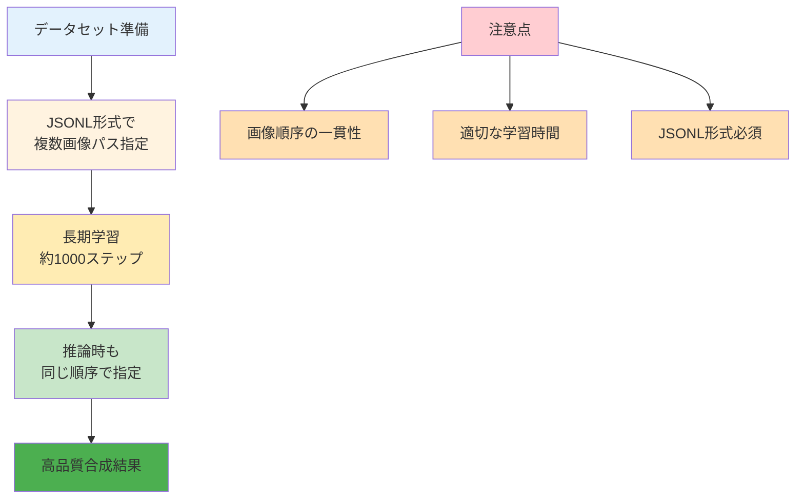

</div>


## 🎆 まとめ：「なんでこんなに複雑なの？」への最終回答

あの「謎パラメータ」たちの正体は、**普通のパソコンで長い動画を作る**という革命的技術を実現するための精密な設計でした。

### 📝 主要困惑ポイント完全解決一覧

| 元の疑問 | 【解決】正体 | 実用的な対処法 |
|----------|-------------|----------------|
| ターゲットインデックスとレイテントインデックスって違うの？ | **同じ機能です！ターゲットインデックスが優先されます** | **ターゲットインデックスのみ調整**（4-6推奨） |
| 履歴インデックス (history_index) って何の履歴？clean indexというキーワードもあるけど？ | **clean index**の方が標準用語で**参照フレーム位置のことです** | 13にしておけば安心 |
| UIの「RoPE値 (latent_window_size)」って何のサイズ？ | **フレーム処理範囲の設定です。厳密にはRoPE値≠latent_window_sizeです** | 9のままでOK |
| じゃあRoPE値 (rope_scaling) って何をするの？ | **位置エンコーディングの精度調整です** | 触らなくてOK |
| clean latentsって掃除？何がキレイになるの？ | **参照画像システムです！お掃除機能ではありません** | LoRAの指示に従う |

**🏆 重要な教訓**: 上記に加えてLoRAの推奨設定に従えば、ほぼ確実に良い結果が得られます。

---

## 📚 専門用語集：困った時はここを見てね

### 基本AI技術の用語

#### インデックス（index）って何？
**ふんわり説明**: 順番を表す番号
- 0番目、1番目、2番目...みたいな感じ
- コンピューターは0から数え始めるのが普通
- target_indexなら「何番目のを作るか」という意味

#### フレームって何？
**ふんわり説明**: 動画の1コマ1コマのこと
- パラパラ漫画の1枚1枚がフレーム
- 動画は実はたくさんのフレーム（静止画）の集まり
- 1秒間に30枚とか60枚のフレームがある

#### テンソル（Tensor）って何？
**ふんわり説明**: AIが使う多次元の数字の箱
- 1次元：数字の列 [1, 2, 3, 4]
- 2次元：表みたいな感じ
- 3次元以上：よくわからないけどAIは使いこなしてる
- T×C×H×W = 時間×チャンネル×高さ×幅の4次元箱

#### レイテント（Latent）って何？
**ふんわり説明**: AIが絵を理解する時の「内部の数字」みたいなもの
- 人間には見えない数字の塊
- AIはこの数字で絵を「覚えて」います
- この数字がちょっとずつズレると絵も変わる
- 「潜在空間」とか難しく言われることもあるけど、要は「AIの頭の中」

**例え話**: 
絵 → AIが数字に変換 → 数字をいじる → 新しい絵ができる
みたいな感じです

#### Diffusion（ディフュージョン）って何？
**ふんわり説明**: ノイズから絵を作る技術
- 最初はザラザラノイズ
- だんだんノイズを取り除いて絵にしていく
- 13億パラメータ = めちゃくちゃ賢いバージョン

#### GPUって何？
**ふんわり説明**: 絵を描くのが得意なパソコンの部品
- グラフィックボード、グラボとも呼ばれる
- 普通のCPUより絵の処理がめちゃくちゃ速い
- RTX 3060、RTX 4090みたいな名前がついてる
- 数字が大きいほど高性能（でも高い）

#### VRAMって何？
**ふんわり説明**: GPUが使えるメモリ（記憶容量）
- 6GB、12GB、24GBみたいに表示される
- 大きいほど複雑な作業ができる
- でも大きいグラボは高い...

#### LoRA（ローラ）って何？
**ふんわり説明**: AIを少しだけ調整する技術
- Low-Rank Adaptationの略らしい
- 元のAIは変えずに、追加部品で性能を調整
- 「この絵柄で描いて」「この人の顔で描いて」みたいな指示ができる
- ファイルサイズが小さくて便利

### HunyuanVideo技術の用語

#### アテンション（Attention）って何？
**ふんわり説明**: AIが「どこを見ればいいか」を決める仕組み
- 人間が写真を見る時、重要な部分に自然と目がいくのと同じ
- AIも「この部分が大事」「この部分は無視していい」を判断する
- 要は「注目ポイント決定システム」

#### 時空間アテンション vs Full Attention って何が違うの？

**従来の時空間アテンション**:
「時間」と「空間」を別々に見る方式
```
時間方向: フレーム1 → フレーム2 → フレーム3 を別々にチェック
空間方向: 画面の上下左右を別々にチェック
→ バラバラに処理するので見落としがある
```
**HunyuanVideoのFull Attention**:
「時間も空間も一緒に」見る方式
```
全部まとめて: フレーム全体 + 画面全体を一度に見る
→ 関係性を見逃さない、性能も良い
```
**例え話**:
- **時空間アテンション**: 右目で時間、左目で空間を別々に見る
- **Full Attention**: 両目でしっかり全体を見る

だから Full Attention の方が賢くて高性能なんですね

#### Dual-stream → Single-stream って何？
**ふんわり説明**: 2つの川が1つの川に合流するイメージ

<div style="width: 100%; overflow-x: auto; margin: 1em 0;">

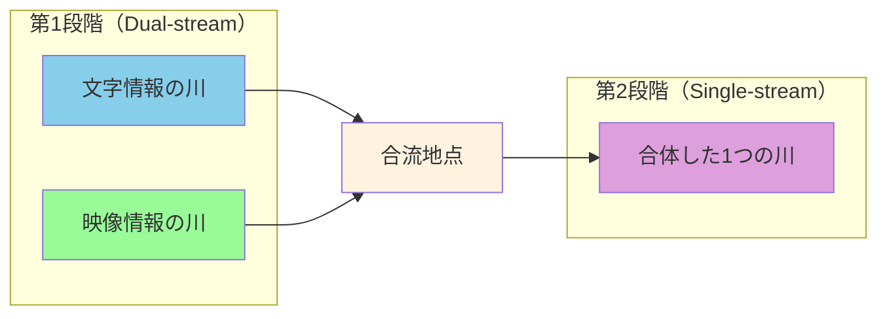

</div>

**なぜこうするの？**:
- 最初は文字と映像を別々に処理（混乱防止）
- 後で合体させて複雑な関係性を理解
- 効率よく賢い処理ができる

#### VAE（ブイエーイー）って何？
**ふんわり説明**: 絵を数字に変換したり戻したりする装置
- Variational AutoEncoderの略らしい
- 絵→数字→絵の変換を担当
- Causal 3D VAEは「原因と結果を考慮した3次元版」
- 要は絵の圧縮・展開を賢くやってくれる

#### RoPE 3D（ロープ3D）って何？
**ふんわり説明**: AIが「どこにいるか」を覚える仕組みの3D版
- RoPE = **R**otary **P**osition **E**mbedding（回転位置エンコーディング）の略
- 従来方式は「位置を足し算」だったが、RoPEは「位置で回転」する革新的手法
- 普通のRoPEは平面（2D）の位置を覚える
- RoPE 3Dは立体（3D）+ 時間も覚える
- つまり「いつ・どこの・どの位置」を全部記録

**技術的な仕組み**:
- 位置に応じて回転角度θを変える（θは位置に比例）
- 相対位置関係を正確に保持
- ベクトルの角度と内積が一定になる数学的特性

**例え話**: 
- 普通のRoPE: 地図上の位置（X座標、Y座標）
- RoPE 3D: 地図 + 高さ + 時間（X、Y、Z、時刻）

#### Binary Mask（バイナリマスク）って何？
**ふんわり説明**: 0と1で「使う/使わない」を決める仕組み
- [1, 0, 0, 0, ...] = 最初だけ使う、後は使わない
- 画像生成時にT=1フレームのみ有効にする時に使用
- 要は「ONとOFFの切り替えスイッチ」

#### Causal制約（コーザル制約）って何？
**ふんわり説明**: 「未来のことは参考にしちゃダメ」という制限
- ターゲットインデックス（target_index＝latent_index）≤ 履歴インデックス （history_index＝clean_index）でないとダメ
- causal = 原因と結果の順序を守る
- 時間の流れに沿った処理を保証

### FramePack技術の用語

#### Anti-drifting（アンチドリフティング）って何？
**ふんわり説明**: 長い動画で画質が悪くなるのを防ぐ技術
- drifting = だんだんズレて品質が悪くなること
- Anti = それを防ぐ
- 双方向サンプリングで品質を保つらしい

#### effective_window_size（エフェクティブ・ウィンドウサイズ）って何？
**ふんわり説明**: 実際に使われるウィンドウの大きさ
- latent_window_sizeが「最大サイズ」、effective_window_sizeが「実際のサイズ」
- 実際の生成フレーム数を決める重要な数字
- effective_window_size=9なら33フレーム、10なら37フレームになる

### 学習・設定関連の用語

#### epochs（エポック）って何？
**ふんわり説明**: 学習データを何回繰り返すかの回数
- 1 epoch = 学習データ全部を1回見る
- 30 epochs = 同じデータを30回繰り返し学習
- 多すぎると覚えすぎて応用が利かなくなる

#### learning_rate（学習率）って何？
**ふんわり説明**: AIがどのくらいの速さで学習するかの設定
- 大きすぎる：焦りすぎて失敗する
- 小さすぎる：のんびりすぎて時間がかかる
- 1e-3 = 0.001 = ちょうどいい速さらしい

#### discrete_flow_shift（ディスクリート・フロー・シフト）って何？
**ふんわり説明**: 学習の流れを調整するパラメータ
- 詳細な動作原理は実装に依存

#### fp_1f_clean_indices（FP 1フレーム クリーンインデックス）って何？
**ふんわり説明**: 1フレーム学習でのclean Latents範囲指定
- [0, 10] = 0番目から10番目までをお掃除対象に
- fp = FramePackの略
- 1f = 1フレームの略

#### fp_1f_no_post（FP 1フレーム ノーポスト）って何？
**ふんわり説明**: 1フレーム学習でpost処理を無効にする設定
- true = post処理をしない
- false = post処理をする
- post処理の具体的内容は実装詳細に依存

---

## 🔗 参考リンク集

### 公式ドキュメント・実装
- **[FramePack GitHub](https://github.com/lllyasviel/FramePack)**: 開発版リポジトリ
- **[FramePack公式サイト](https://lllyasviel.github.io/frame_pack_gitpage/)**: オリジナル実装とドキュメント
- **[HunyuanVideo論文](https://arxiv.org/html/2412.03603v1)**: 基盤技術の学術論文

### 拡張実装・ツール
- **[musubi-tuner](https://github.com/kohya-ss/musubi-tuner)**: 学習機能拡張版
- **[ComfyUI-FramePackWrapper_PlusOne](https://github.com/tori29umai0123/ComfyUI-FramePackWrapper_PlusOne)**: ComfyUI統合版
- **[mattyamonaca氏のスクラップ](https://zenn.dev/mattyamonaca/scraps/52cec92dc49cfe)**: 実装詳細と技術解説

### 技術解説・実証データ
- **Kohya Tech氏**: X(Twitter)での実証実験と最適化データ
- **エマノン氏**: X(Twitter)での検証結果とパラメータ調整
- **Musubi Tuner PR #306, #331**: 実装詳細とコード解析

### コミュニティ・サポート
- **GitHub Issues**: 技術的な質問とトラブルシューティング

このガイドが、あの謎めいたパラメータたちとの「なんとなく理解」の架け橋になれば幸いです♪